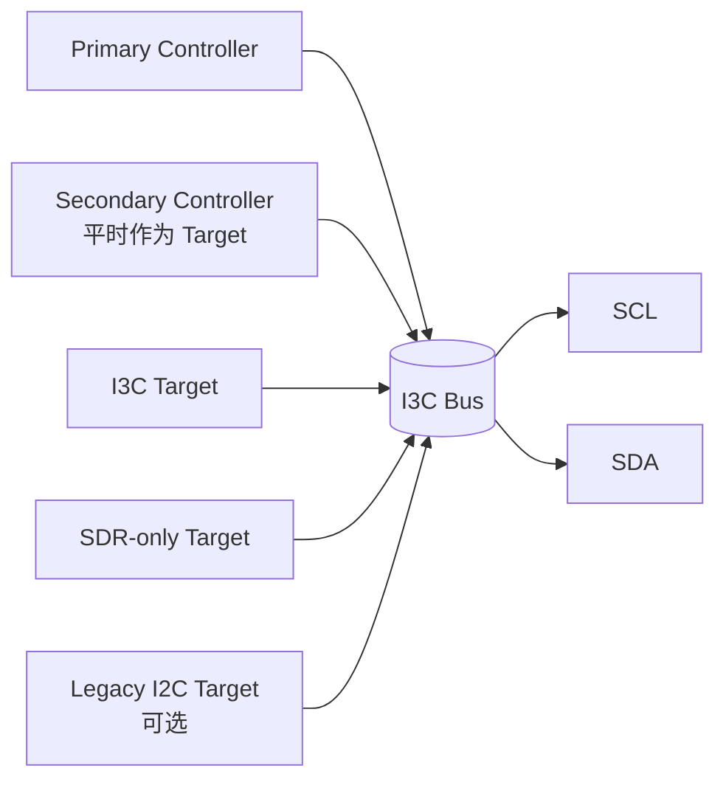
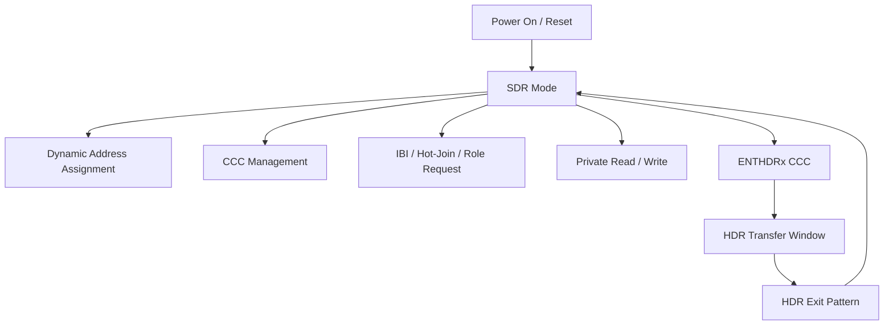
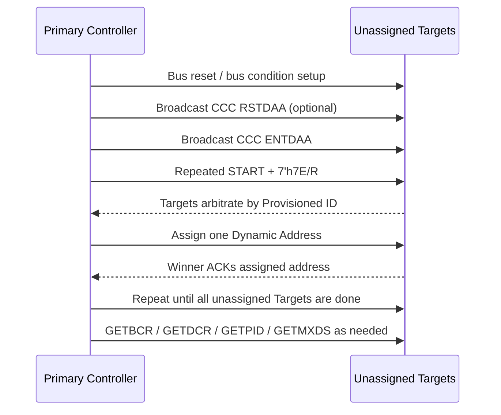
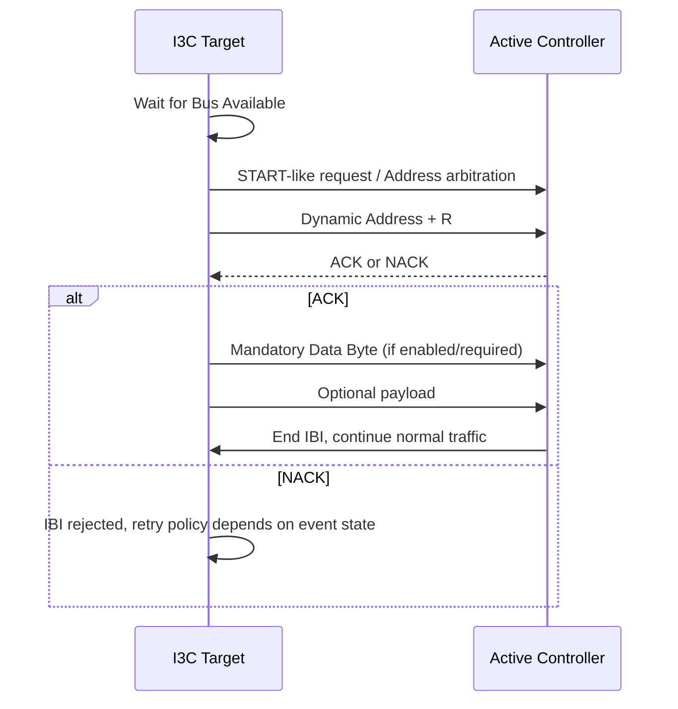
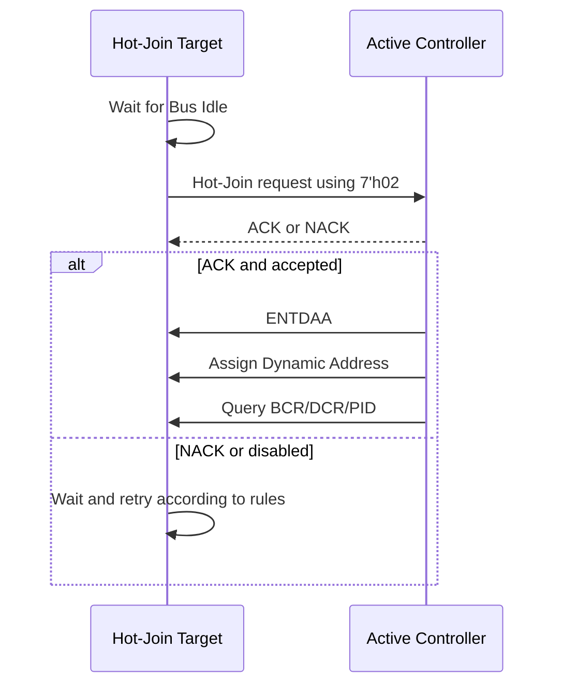
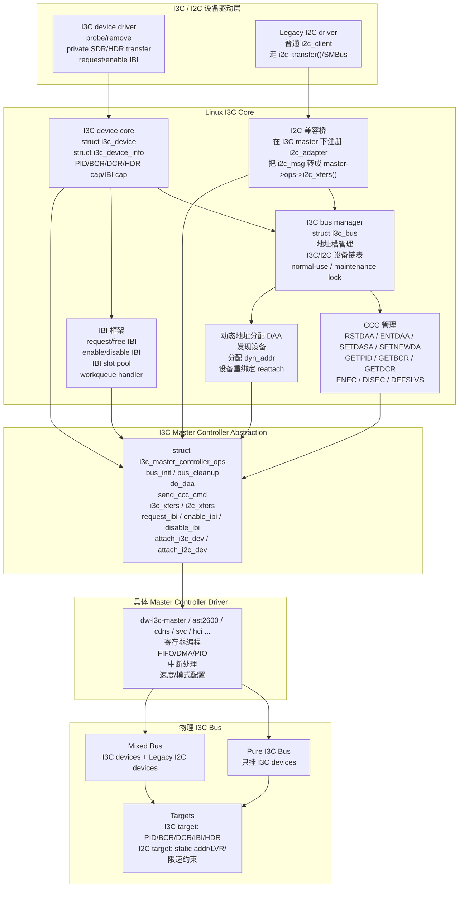

# MIPI I3C Basic v1.1.1 组内分享

> 面向嵌入式、OS、固件、驱动开发同学。目标不是逐条翻译规范，而是把 I3C Basic 的协议模型、驱动实现边界、bring-up 调试重点讲清楚。

## 0. 分享目标和阅读地图

这份文档整理自当前目录下的 I3C Basic v1.1.1 规范全文、中文转写稿、章节讲解笔记，以及本地 PDF 中的总线架构和协议波形图。建议分享时按下面主线推进：

1. 为什么 I3C 不是“更快的 I2C”
2. I3C 总线上的角色和状态
3. SDR 模式：所有管理能力的基础控制面
4. 动态地址分配、CCC、IBI、Hot-Join 四个核心机制
5. HDR 模式：高速数据面
6. 驱动实现、调试和验证关注点

**一句话总纲：I3C 用两根线保留 I2C 的多点低成本优势，同时把地址管理、中断、热加入、多 Controller、低功耗和高速传输变成协议内能力。**

## 1. 背景：I3C 要解决什么问题

传统移动终端、IoT、板级管理和传感器子系统里，I2C、SPI、UART 往往混用。真正让硬件系统复杂的不是主数据接口本身，而是每个外设旁边附带的 `INT`、`EN`、`RESET`、`SLEEP`、`CS` 等 side-band 信号。传感器数量一多，SoC GPIO、封装 pin、PCB 层数和电源管理复杂度都会上升。


I3C 的基本设计目标可以归纳成四点：

| 目标 | I3C 的做法 | 对驱动/系统的影响 |
|---|---|---|
| 少引脚 | 仍然只用 SCL/SDA 两根线 | 中断、热加入、控制命令进入协议内 |
| 更高速 | SCL 多数时间 push-pull，SDA 数据阶段可 push-pull；SDR 到 12.5 MHz，HDR 更高 | 不能再按纯 I2C open-drain 模型写控制器 |
| 更低功耗 | 减少 open-drain 上拉电流和无效切换 | 需要正确管理 Activity State、事件使能、总线空闲 |
| 更可管理 | 动态地址、CCC、IBI、Hot-Join、多 Controller | 初始化和状态机明显比 I2C 复杂 |

与 I2C/SPI 的高层对比如下：


要注意：I3C 兼容的是 **Legacy I2C Target**，不是 I2C Controller。I3C 总线上不能再挂一个传统 I2C Master 参与仲裁。

## 2. I3C 的总线心智模型

I3C 仍然是两线、多点、共享总线，但协议中心从“I2C 风格的主从读写”升级为“当前 Controller 管理一组 Target 的总线系统”。



### 2.1 术语变化

MIPI 新版文档推荐使用 `Controller/Target` 替代 `Master/Slave`。在驱动代码和旧 IP 文档里仍可能看到 master/slave，但理解时应映射成：

| 旧术语 | 新术语 | 含义 |
|---|---|---|
| Master | Controller | 控制总线、发 SCL、发起 transfer 的设备 |
| Slave | Target | 响应地址、CCC、读写请求的设备 |
| Current Master | Active Controller | 当前真正控制总线的 Controller |
| Main Master | Primary Controller | 初始化和配置总线的 Controller |
| Secondary Master | Secondary Controller | 有 Controller 能力，但平时作为 Target |

### 2.2 同一时刻只有一个 Active Controller

I3C 支持多 Controller，但不等价于多个 Controller 同时开车。规则是：

```text
Primary Controller 负责初始配置
Secondary Controller 平时作为 Target 存在
需要接管时发 Controller Role Request
Active Controller 批准后进行 Controller Role Handoff
任意时刻总线上只有一个 Active Controller
```

这对驱动框架很关键：I3C host controller driver 不只是传输引擎，还要维护“当前总线拥有者、目标设备表、事件使能、动态地址、IBI 队列、Hot-Join 状态”等总线管理状态。

## 3. 总线配置：Pure、Mixed Fast、Mixed Slow

I3C 的性能和兼容性强依赖总线拓扑。

| 总线类型 | 设备组成 | 关键约束 |
|---|---|---|
| Pure Bus | 只有 I3C 设备 | 最容易发挥 I3C 高速能力 |
| Mixed Fast Bus | I3C + 带 50 ns spike filter 的 Legacy I2C Target | I3C 可用短 SCL high 让 I2C Target 看不见部分 I3C 流量 |
| Mixed Slow/Limited Bus | I3C + 不满足 fast mixed 条件的 Legacy I2C Target | 时钟、HDR、部分优化受限最多 |

驱动 bring-up 时必须回答三个问题：

1. 总线上有没有 Legacy I2C Target？
2. Legacy I2C Target 的地址是否与 I3C 保留地址或动态地址策略冲突？
3. Legacy I2C Target 是否具备 50 ns spike filter，能否进入 Mixed Fast Bus？

## 4. I3C 的地址空间

I3C 仍使用 7-bit 地址，但地址语义比 I2C 更严格。

| 地址 | 用途 |
|---|---|
| `7'h00`、`7'h01` | 保留 |
| `7'h02` | Hot-Join 地址 |
| `7'h7E` | I3C Broadcast Address，CCC 和模式入口核心地址 |
| `7'h7F` | 保留 |
| `7'h3E`、`7'h5E`、`7'h6E`、`7'h76`、`7'h7A`、`7'h7C` | 与 `7'h7E` 单 bit 接近，限制用于提升广播地址错误检测 |
| 其他非冲突地址 | 可作为 I3C 动态地址，仍需避开板上 Legacy I2C 静态地址 |

**工程建议：需要发 IBI 或可能成为 Secondary Controller 的设备，优先分配较低动态地址。**原因是 START 后地址仲裁时，低地址更容易赢；IBI 优先级也和动态地址有关。

## 5. SDR：I3C 的基础控制面

I3C 上电和绝大多数管理动作都从 SDR 开始。即使后续要跑 HDR-DDR 或 HDR-BT，也必须先通过 SDR 完成初始化、能力发现和 Enter HDR CCC。



### 5.1 SDR 的外形像 I2C，但第 9 bit 语义不同

SDR 的基本帧仍然是：

```text
START -> Address/Header -> ACK/NACK -> Data Words -> STOP
```

但数据 word 的第 9 bit 已经不是传统 I2C ACK。

| 场景 | I2C 第 9 bit | I3C SDR 第 9 bit |
|---|---|---|
| Controller 写 Target | Target ACK/NACK | Controller 发送 parity T-bit |
| Controller 读 Target | Controller ACK/NACK | Target 发送 T-bit：继续或结束 |
| 地址阶段 | Target ACK/NACK | 仍是 ACK/NACK，open-drain 语义 |

下面这张规范图清楚展示了 I3C 私有读写里 T-bit 的位置。注意图例里写数据 T-bit 是 parity，读数据 T-bit 是 End-of-Data。


### 5.2 写传输：T-bit 是奇校验

Controller 写 Target 时：

```text
Target Dynamic Address + W + ACK
Data[7:0] + T
Data[7:0] + T
...
```

其中 `T` 是 8-bit data 的奇校验位。用伪代码表达：

```c
/* Odd parity over 8-bit data plus T-bit. */
t_bit = parity_even(data) ? 1 : 0;
```

调波形时不要把写数据后的第 9 bit 当成 Target ACK。如果控制器 IP 或逻辑分析仪还按 I2C 解码，会出现“每个字节 ACK 异常”的误判。

### 5.3 读传输：Target 也能结束读

Controller 读 Target 时：

```text
Target Dynamic Address + R + ACK
Target Data[7:0] + T
Target Data[7:0] + T
...
```

读数据的 T-bit 由 Target 驱动：

| T-bit | 语义 |
|---|---|
| `1` | Target 表示可以继续读 |
| `0` | Target 表示本次 read message 到此结束 |

这正是 I3C 和 I2C 的一个关键差异：I2C 读传输只能由 Master 通过 NACK 结束；I3C SDR 读传输里 Target 可以通过 `T=0` 主动结束。Controller 仍然可以在 Target 表示继续时提前中止，但要按 I3C 的总线接管时序执行。

### 5.4 START 后 Header 可以仲裁

I3C 的 START 后 Header 不是简单的 Controller 地址输出，因为 Target 也可能趁 Bus Available 时发起事件：

```text
IBI               Target 请求中断
Hot-Join          新设备请求加入总线
Controller Role   Secondary Controller 请求接管
```

仲裁仍基于 open-drain 规则：

```text
发送 0：主动拉低 SDA
发送 1：释放 SDA 并观察
如果自己发送 1 但看到 SDA 为 0，说明输掉仲裁
```

Repeated START 后的 Header 通常不再用于这种事件仲裁，Address/RnW 可 push-pull 发送，ACK/NACK 仍保留 open-drain 语义。

## 6. 动态地址分配 DAA

I3C 最重要的管理能力之一是 Dynamic Address Assignment。它解决的是 I2C 静态地址冲突、设备发现困难和上电配置硬编码的问题。

### 6.1 DAA 的输入信息

每个参与 DAA 的 I3C Target 需要能提供可仲裁、可识别的身份信息。典型核心是 48-bit Provisioned ID：

| 字段 | 作用 |
|---|---|
| MIPI Manufacturer ID | 厂商标识 |
| ID Type Selector | 区分随机值或厂商固定值 |
| Part ID | 器件型号或部件标识 |
| Instance ID | 多实例区分 |
| Extra / Vendor bits | 厂商自定义 |

实际驱动不应假设“地址固定等于某个设备”。正确做法是通过 DAA 后的设备表、PID/BCR/DCR 和板级描述共同建立枚举关系。

### 6.2 典型初始化流程



### 6.3 DAA 的驱动实现要点

1. DAA 不是一次性“扫地址”，而是通过 Target 身份仲裁逐个分配动态地址。
2. 分配策略要避开 `7'h7E` 及相关保留/限制地址，也要避开 Legacy I2C 静态地址。
3. 如果设备需要较高 IBI 优先级，可以在地址分配策略上给它更低动态地址。
4. DAA 完成后要读取 BCR/DCR/PID 等能力信息，建立软件设备表。
5. 每次总线 reset、Target reset、Controller crash recovery 后，都要重新评估动态地址是否仍有效。

## 7. CCC：I3C 的总线管理命令通道

CCC 是 Common Command Code。可以把它理解成 I3C 的“协议内控制面命令集”。很多 I3C 能力都不是私有寄存器访问，而是 CCC。

### 7.1 Broadcast CCC 和 Direct CCC

| 类型 | 地址入口 | 作用 |
|---|---|---|
| Broadcast CCC | `7'h7E + W` | 面向所有 I3C Target，例如 `ENTDAA`、`RSTDAA`、`ENTHDRx` |
| Direct CCC | 先 `7'h7E + W` 发 CCC，再用目标动态地址访问 | 面向某个 Target，例如 `GETPID`、`GETBCR`、`GETDCR` |

Direct CCC 的典型结构如下：


Broadcast CCC 的典型结构如下：


### 7.2 常用 CCC 分类

| 类别 | 代表命令 | 作用 |
|---|---|---|
| 地址管理 | `ENTDAA`、`RSTDAA`、`SETDASA`、`SETNEWDA` | 动态地址分配和变更 |
| 事件管理 | `ENEC`、`DISEC` | 使能/禁用 IBI、Hot-Join、Controller Role Request |
| 能力查询 | `GETPID`、`GETBCR`、`GETDCR`、`GETMXDS`、`GETCAPS` | 枚举 Target 能力 |
| 传输限制 | `SETMWL`、`SETMRL`、`GETMWL`、`GETMRL` | 最大读写长度 |
| HDR 入口 | `ENTHDR0`、`ENTHDR3` 等 | 从 SDR 进入 HDR 模式 |
| 多 Controller | `GETACCCR`、`DEFTGTS` | Controller role handoff 和 Target 表同步 |
| 复位/恢复 | `RSTACT`、Target Reset Pattern | Target reset 和恢复 |

### 7.3 CCC 的实现边界

驱动里容易犯的错误是把 CCC 当成普通 write/read transfer。CCC 需要单独建模，原因是：

1. CCC 入口通常固定从 `7'h7E` 开始。
2. Direct CCC 可能包含“先广播命令码，再 repeated START 到目标地址”的复合帧。
3. 不同 CCC 的 payload 长度、方向、是否 broadcast/direct 都不一样。
4. 某些 CCC 会改变总线全局状态，例如 DAA、HDR 入口、事件使能。
5. HDR 模式下可用 CCC 是受限集合，不应假设 SDR CCC 都能在 HDR 中使用。

## 8. IBI：带内中断

IBI 是 In-Band Interrupt。它的价值是去掉每个 Target 的外部中断引脚，让 Target 通过 I3C 总线本身请求 Controller 服务。

### 8.1 IBI 基本流程



IBI 的优先级通常由动态地址仲裁体现：动态地址越低，越容易赢得 START 后仲裁。因此中断密集或时延敏感的 Target，地址分配策略上应放在低地址区域。

### 8.2 Mandatory Data Byte

部分 Target 的 IBI 带 Mandatory Data Byte，用来告诉 Controller 中断类型或目标内部状态。驱动里要先根据 BCR/设备能力判断 IBI 是否带 MDB，不能所有 IBI 都按同一个长度处理。

### 8.3 IBI 调试重点

1. 是否通过 `ENEC` 使能了 Target event？
2. Target 的动态地址是否过高，导致多 IBI 仲裁时优先级不符合预期？
3. Controller NACK IBI 后，软件是否错误地认为中断已经被处理？
4. IBI payload 长度和 MDB 解析是否匹配设备 BCR/私有协议？
5. 当前是否处在 HDR transfer window 中？IBI 通常依赖 SDR 管理事件，不能随意插入 HDR 内部。

## 9. Hot-Join：运行中加入总线

Hot-Join 允许 Target 在总线已经初始化后请求加入。例如设备刚上电、模块热插入、或者某个电源域后启动。



Hot-Join 对软件框架的影响很直接：I3C bus 不能被看作“probe 时固定完成枚举”的静态总线。驱动需要支持运行时新增 Target、重新分配动态地址、更新设备表，并避免在 transfer 进行中破坏当前 frame。

## 10. Controller Role Handoff

多 Controller 是 I3C 的高级能力。Secondary Controller 平时作为 Target，必要时通过 Controller Role Request 请求成为 Active Controller。

```text
Secondary Controller 发起 Role Request
Active Controller 识别并决定是否允许
Active Controller 通过 CCC/流程同步目标列表和总线配置
总线控制权交给 Secondary Controller
Secondary Controller 完成事务后归还或继续按规则管理
```

驱动实现时至少要区分：

| 状态 | 软件含义 |
|---|---|
| 本控制器是 Primary Controller | 负责初始化、DAA、默认总线管理 |
| 本控制器是 Active Controller | 可以发起当前 transfer |
| 本控制器是 Secondary Controller/Target | 不能直接抢 SCL，需要按 role request 流程 |
| Handoff in progress | 需要冻结普通 transfer 队列，避免总线状态错乱 |

如果 SoC/系统永远只有一个 Controller，可以先把 role handoff 作为 unsupported capability 明确屏蔽，但不能让硬件误响应相关事件。

## 11. HDR：高速数据面

HDR 是 High Data Rate。它不是替代 SDR 的新总线初始化模式，而是 **从 SDR 进入、在专用窗口内传输、再退出回 SDR** 的高速数据面。

```text
SDR:
  START -> 7'h7E + W -> ENTHDRx + T

HDR:
  HDR command/header
  HDR data
  CRC / parity
  HDR Restart 或 HDR Exit

SDR:
  STOP 或继续 SDR traffic
```

I3C Basic v1.1.1 中最需要关注的是：

| HDR 模式 | 入口 CCC | 核心模型 | 适用场景 |
|---|---|---|---|
| HDR-DDR | `ENTHDR0` | 双沿传输，Command/Data/CRC Word | 中等长度高速读写 |
| HDR-BT | `ENTHDR3` | Bulk Transport，Header/Data Block/CRC Block | 大块数据搬运，适合 FIFO/DMA 模型 |

完整 I3C 规范里的 HDR-TSP/HDR-TSL 不属于 I3C Basic 支持范围。

### 11.1 HDR-DDR

HDR-DDR 的关键点：

1. 通过 SDR `ENTHDR0` 进入。
2. SDA 在 SCL 的上升沿和下降沿都承载数据。
3. 传输单位是 HDR-DDR Word，包含 preamble、data、parity/CRC 等结构。
4. 可用 HDR Restart 继续下一笔 HDR transfer，也可用 HDR Exit 回到 SDR。


驱动实现上，HDR-DDR 不能复用普通 SDR byte FIFO 模型。它更接近“word command + data word stream + CRC”的专用传输模式。

### 11.2 HDR-BT

HDR-BT 是 Bulk Transport，面向更大的数据块：

1. 通过 SDR `ENTHDR3` 进入。
2. 先发送 Header Block，描述方向、地址、控制信息、lane 等。
3. 后续是一个或多个 Data Block。
4. 结尾使用 CRC Block。
5. 可支持多 lane 模型，适合高吞吐搬运。


驱动视角下，HDR-BT 更适合与 DMA、FIFO watermark、burst 长度、缓存一致性策略一起设计。不要把它理解成“更快的 SDR read/write”。

### 11.3 HDR 和事件的关系

IBI、Hot-Join、Controller Role Request 本质上是 SDR 管理事件。进入 HDR 后，Target 即使不支持当前 HDR 模式，也必须能识别 HDR Exit Pattern，至少能等总线回到 SDR。实现上要注意：

1. 不要在 HDR 中执行 DAA。
2. 不要假设 Target 可在 HDR 内随时发 IBI。
3. 进入 HDR 前要确认目标 Target 支持对应 HDR 模式。
4. HDR 异常退出后要恢复到可预测 SDR 状态，必要时做 bus recovery。

## 12. 错误检测和恢复

I3C 的错误处理比 I2C 更系统。SDR 写数据有 parity，HDR 有 parity/CRC，Controller 和 Target 对不同错误有不同恢复责任。

常见错误类别可以按工程视角归纳：

| 错误类型 | 可能原因 | 软件处理方向 |
|---|---|---|
| Parity 错误 | SDR 写数据 T-bit 错、采样边沿异常、信号完整性问题 | 记录目标地址和 byte offset，必要时重试 |
| CRC 错误 | HDR 数据错误、lane 配置错误、时序/电气问题 | 丢弃当前 HDR transfer，回到 SDR 后恢复 |
| NACK | Target 不存在、不支持 CCC、忙、错误状态 | 区分地址 NACK、CCC NACK、data NACK |
| SDA stuck | Target 未释放 SDA、reset 中断、上电时序异常 | 执行控制器 bus recovery 或 Target reset |
| DAA collision/失败 | PID 冲突、Target 实现异常、地址分配冲突 | 重试 DAA，必要时隔离设备 |
| IBI storm | Target 事件未清、MDB 解析错误、驱动未处理源状态 | 禁用事件、读取状态、清中断后再使能 |

### 12.1 Clock Stall 不是 I2C Clock Stretch

I3C 中 SCL 通常由 Controller push-pull 驱动。Target 不像 I2C 那样随意 clock stretching。规范允许 Controller 在某些阶段延长 SCL low：

| 场景 | 典型用途 |
|---|---|
| ACK/NACK 阶段 | 给 Controller/Target 状态机留处理时间 |
| 写数据 parity bit | 等待校验或 FIFO |
| 读数据 T-bit | 处理继续/结束和总线接管 |
| DAA 分配地址首 bit | 给动态地址分配流程留更长响应时间 |

驱动调试时如果看到 SCL low 被拉长，先判断是不是 Controller 合法 stall，而不是按 I2C 思维直接怀疑 Target clock stretch。

## 13. 驱动实现建议

### 13.1 软件模块划分

一个可维护的 I3C Controller driver 至少应拆出以下概念：

| 模块 | 责任 |
|---|---|
| Bus Manager | 总线初始化、DAA、设备表、地址策略 |
| Transfer Engine | SDR private transfer、CCC transfer、HDR transfer |
| Event Manager | IBI、Hot-Join、Controller Role Request |
| Device Model | PID/BCR/DCR、动态地址、静态地址、能力缓存 |
| Recovery | bus reset、Target reset、SDA stuck、DAA retry |
| Power/Activity | ENTASx、事件开关、runtime PM |

### 13.2 初始化伪流程

```text
1. 初始化 Controller IP、pinmux、时钟、FIFO/DMA
2. 置总线到已知空闲状态，处理可能的 SDA stuck
3. 加载板级 Legacy I2C Target 信息和限制
4. 规划动态地址池，避开保留地址和 Legacy I2C 地址
5. 对有静态地址的 I3C Target 可先 SETDASA
6. 对未知 I3C Target 执行 ENTDAA
7. 对每个 Target 读取 GETPID/GETBCR/GETDCR/GETMXDS/GETCAPS
8. 注册 I3C device，绑定上层 function driver
9. 根据需求 ENEC 使能 IBI/Hot-Join/CRR
10. 正常处理 SDR/HDR transfer 和 runtime event
```

### 13.3 Transfer API 不要照搬 I2C

I2C 常见 API 是 `addr + flags + len + buf`。I3C 如果完全照搬，会很快遇到表达力不足：

| I3C 需求 | 为什么 I2C API 不够 |
|---|---|
| CCC | 需要表达 broadcast/direct、命令码、payload 方向 |
| DAA | 不是普通地址扫描 |
| IBI | 不是被动读，是 Target 发起事件 |
| HDR | word/block/CRC/lane 结构不同 |
| Target 主动结束 read | read length 可能不是 Controller 完全预知 |
| Dynamic Address | 地址是运行时资源，不是固定硬件属性 |

建议在驱动内部明确区分：

```text
i3c_sdr_priv_xfer
i3c_ccc_xfer
i3c_daa
i3c_ibi_enable / disable / handle
i3c_hdr_xfer
i3c_bus_recovery
```

## 14. Bring-up 和调试检查表

### 14.1 上电后先确认电气和拓扑

- SCL/SDA 空闲电平是否为 high
- 上拉和 high-keeper 配置是否符合板级设计
- Legacy I2C Target 是否存在，地址是否冲突
- I2C Target 是否带 50 ns spike filter，决定 mixed bus 能力
- Controller 是否正确配置 open-drain/push-pull 切换

### 14.2 DAA 不通时

- 是否有 Target 支持至少一种动态地址分配方式
- `7'h7E` broadcast 是否被所有 I3C Target ACK
- PID 仲裁阶段 SDA 是否有多个 Target 同时驱动
- 分配地址是否落入保留/限制/冲突范围
- Target ACK assigned dynamic address 是否正常
- 失败后是否残留半分配状态，需要 RSTDAA 或 bus reset

### 14.3 CCC 不通时

- CCC 是 broadcast 还是 direct
- Direct CCC 是否正确执行 `7'h7E + CCC + Sr + Target Address`
- Payload 方向和长度是否匹配规范
- 写数据 T-bit parity 是否正确
- Target 是否 NACK 了不支持的 CCC
- 当前模式是否允许该 CCC

### 14.4 IBI 不通时

- 是否对 Target 执行 ENEC 使能事件
- BCR 是否表明支持 IBI 和 MDB
- Controller 是否打开 IBI 接收队列/中断
- IBI 地址仲裁是否输给其他事件
- Controller NACK 后 Target 的重试策略是否被正确处理
- 上层 function driver 是否及时清除 Target 内部中断源

### 14.5 HDR 不通时

- Target 是否通过 GETMXDS/GETCAPS 表示支持对应 HDR 模式
- 是否从 SDR 通过正确 ENTHDRx 进入
- HDR Restart 和 HDR Exit Pattern 是否被所有 Target 正确识别
- DDR 双沿采样时序是否满足控制器和板级约束
- CRC/parity 错误是否能恢复到 SDR
- DMA/FIFO 数据粒度是否匹配 HDR-DDR word 或 HDR-BT block

## 15. 最容易踩的坑

1. **把 I3C 当成更快的 I2C。** I3C 真正复杂的是总线管理和事件模型，不只是时钟更快。
2. **把 SDR 写数据第 9 bit 当 ACK。** 写数据第 9 bit 是 Controller 发的 parity T-bit。
3. **把 SDR 读数据长度看作 Controller 单方面决定。** Target 可以通过 T-bit 主动结束读。
4. **动态地址硬编码。** 动态地址是运行时分配结果，不能当成设备固定身份。
5. **忽略 `7'h7E`。** Broadcast Address 是 CCC、DAA、Enter HDR 的核心入口。
6. **在 HDR 里做管理动作。** DAA、Hot-Join、IBI、Role Request 等主线仍在 SDR 管理面。
7. **没有区分 open-drain 和 push-pull 阶段。** ACK/仲裁、数据、Repeated START 后 Header 的驱动方式不同。
8. **Legacy I2C 兼容性只看地址。** 还要看 spike filter、LVR、总线速度和 I3C 流量可见性。
9. **IBI 没有背压策略。** 高频 IBI 设备需要地址优先级、队列和上层清源配合。
10. **Recovery 设计不足。** I3C 比 I2C 更依赖控制器状态机，异常后要能回到可预测 SDR 状态。

## 16. 建议的组内分享节奏

| 时间 | 内容 |
|---|---|
| 5 min | 背景：为什么 I3C 解决的是系统 pin/GPIO/功耗问题 |
| 10 min | 总线模型：Controller/Target、Pure/Mixed Bus、地址空间 |
| 20 min | SDR 核心：Header 仲裁、T-bit、DAA、CCC |
| 15 min | 事件机制：IBI、Hot-Join、Controller Role Request |
| 10 min | HDR：HDR-DDR、HDR-BT、为什么它是高速数据面 |
| 15 min | 驱动实现：模块划分、初始化流程、调试检查表 |
| 10 min | Q&A：结合当前 IP、板级拓扑和验证计划 |

## 17. 参考材料

- `mipi_I3C-Basic_specification_v1-1-1.pdf`：MIPI I3C Basic Specification v1.1.1，Public Release Edition。
- `2026-06-06-i3c-basic-spec-v1-1-1.md`：由规范 PDF 转写的全文 Markdown。
- `MIPI_I3C中文文档_1616318682792.pdf` 与 `2026-06-06-mipi-i3c-chinese-doc.md`：中文转写材料。
- `AMF-DES-T2686.pdf` 与 `2026-06-06-mipi-i3c-introduction.md`：NXP I3C introduction，适合做背景和架构引入。
- `第三章讲解.md`、`第四章讲解.md`、`第四章节第二部分讲解.md`：当前目录下已有章节学习笔记。
- `Broadcast CCC典型用法.md`、`Slave终止read能力解析.md`：针对 CCC 和 T-bit/读终止语义的专题笔记。


---

## 18. 实战：AST2600 QEMU + Linux I3C 调试闭环

> 本节是基于本次 AST2600 I3C 调试经验追加的工程实践记录。前面 1-17 节保持原样，这一节只补充 Linux/QEMU 驱动工作流、关键日志和新增验证驱动，方便后续复盘和组内学习。

### 18.1 调试目标

这次不是只验证 I3C Basic 规范里的概念，而是把一条最小但完整的链路跑通：

1. QEMU AST2600 EVB 暴露一个 DesignWare-compatible I3C controller。
2. Linux `ast2600-i3c-master` 平台驱动完成 probe。
3. Linux I3C core 注册 master，执行 RSTDAA、DISEC、ENTDAA。
4. QEMU 模拟一个 synthetic I3C target，PID 为 `0x123456789abc`。
5. Linux 通过 GETPID/GETBCR/GETDCR 读取 target 信息并创建设备。
6. 新增 Linux synthetic target test driver 绑定该设备。
7. 通过 private SDR write/read 验证 QEMU target 寄存器读写闭环。

最终验证脚本：

```sh
scripts/verify_ast2600_i3c_target.sh
```

每次脚本运行时，完整 QEMU/kernel 日志写到：

```text
/tmp/qemu_ast2600_i3c_target_verify.log
```

当前成功输出：

```text
0-123456789abc
```

关键成功日志：

```text
i3c-synthetic-target-test 0-123456789abc: private SDR read/write OK reg=0x10 value=0x5a
```

### 18.2 Linux 驱动工作流

AST2600 的 Linux 侧不是一个完全独立的 master driver，而是 AST2600 glue driver 加 DesignWare I3C master core 的组合。调试时建议按这条调用链看：

```text
Device Tree i3c@1e7a2000
  -> ast2600_i3c_probe()
  -> dw_i3c_common_probe()
  -> i3c_master_register()
  -> i3c_master_bus_init()
  -> dw_i3c_master_bus_init()
  -> RSTDAA
  -> DISEC
  -> i3c_master_do_daa()
  -> dw_i3c_master_daa()
  -> add_i3c_dev_locked()
  -> i3c_master_retrieve_dev_info()
  -> GETPID / GETBCR / GETDCR
  -> i3c_device_match_id()
  -> i3c-synthetic-target-test.probe()
  -> private SDR read/write/read
```

这条链路里几个边界要分清：

- `drivers/i3c/master/ast2600-i3c-master.c`：AST2600 平台相关 glue，负责 global register、pull-up 配置、platform ops，然后进入 DesignWare common probe。
- `drivers/i3c/master/dw-i3c-master.c`：通用 DesignWare master 实现，负责 FIFO/capability 初始化、DAT 分配、CCC、DAA、response queue 和 private transfer。
- `drivers/i3c/master.c`：Linux I3C core，负责 master 注册、bus init、设备枚举、设备信息读取和 driver match。
- `drivers/i3c/i3c-synthetic-target-test.c`：本次新增的验证驱动，只用于 qemu_exp 验证 synthetic target private SDR，不是生产协议驱动。

### 18.3 带 trace 的实际日志

为了学习工作流，单独建了一个带日志的分支：

```text
debug/i3c-workflow-trace
```

远程分支：

```text
origin/debug/i3c-workflow-trace
```

对应 patch：

```text
patches/linux/0005-i3c-add-workflow-trace-prints.patch
```

日志节选如下，可以直接对照上一节调用链阅读：

```text
ast2600-i3c-master 1e7a2000.i3c: ast2600-i3c: probe start, node=/ahb/apb/i3c@1e7a2000
ast2600-i3c-master 1e7a2000.i3c: dw-i3c: common_probe start
ast2600-i3c-master 1e7a2000.i3c: dw-i3c: hw caps cmd_fifo=16 data_fifo=16 max_devs=8 dat_start=0x100
i3c: master_register start, secondary=0
i3c: calling i3c_master_bus_init
ast2600-i3c-master 1e7a2000.i3c: dw-i3c: bus_init start, bus_mode=0
ast2600-i3c-master 1e7a2000.i3c: dw-i3c: master dyn_addr=0x08
ast2600-i3c-master 1e7a2000.i3c: dw-i3c: send_ccc ccc_id=0x06 ndests=1 rnw=0
i3c: rstdaa before DAA returned 0
ast2600-i3c-master 1e7a2000.i3c: dw-i3c: send_ccc ccc_id=0x01 ndests=1 rnw=0
i3c: DISEC before DAA returned 0
i3c: do_daa start
ast2600-i3c-master 1e7a2000.i3c: dw-i3c: DAA start, maxdevs=8 free_pos=0xff
ast2600-i3c-master 1e7a2000.i3c: dw-i3c: ENTDAA cmd queued dev_index=0 dev_count=8
ast2600-i3c-master 1e7a2000.i3c: dw-i3c: resp[0] tid=0 data_len=7 err=0x4
ast2600-i3c-master 1e7a2000.i3c: dw-i3c: DAA result rx_len=7 newdevs=0x1 olddevs=0xffffff00
i3c: add_i3c_dev_locked addr=0x09
i3c: retrieve_dev_info dyn_addr=0x09
ast2600-i3c-master 1e7a2000.i3c: dw-i3c: send_ccc ccc_id=0x8d ndests=1 rnw=1
ast2600-i3c-master 1e7a2000.i3c: dw-i3c: send_ccc ccc_id=0x8e ndests=1 rnw=1
ast2600-i3c-master 1e7a2000.i3c: dw-i3c: send_ccc ccc_id=0x8f ndests=1 rnw=1
i3c: do_daa returned 0
ast2600-i3c-master 1e7a2000.i3c: dw-i3c: i3c_master_register OK, probe complete
i3c-synthetic-target-test 0-123456789abc: i3c: device_do_xfers nxfers=2 mode=31
ast2600-i3c-master 1e7a2000.i3c: dw-i3c: i3c_xfers start nxfers=2 mode=31 dev_index=0
ast2600-i3c-master 1e7a2000.i3c: dw-i3c: resp[1] tid=1 data_len=1 err=0x0
i3c-synthetic-target-test 0-123456789abc: private SDR read/write OK reg=0x10 value=0x5a
0-123456789abc  i3c-0
```

这里的 `err=0x4` 在 ENTDAA 结束处不是普通失败，它对应 DesignWare response error 的 `IBA_NACK`，Linux driver 用这个状态判断 DAA 轮次结束。QEMU 模型里用 `data_len = I3C_DAT_DEPTH - dev_index - 1` 表达“本轮分配了一个新设备，还剩多少 DAT slot”。

### 18.4 QEMU AST2600 I3C 模型实现

QEMU 新增的模型是一个最小 DesignWare-compatible AST2600 I3C controller，目标不是完整覆盖 I3C 规范，而是满足 Linux master driver 的关键路径：probe、bus init、DAA、direct CCC read、private SDR transfer。

关键文件：

```text
qemu-mods/hw/misc/aspeed_i3c.c
qemu-mods/include/hw/misc/aspeed_i3c.h
```

核心寄存器和 synthetic target 常量：

```c
#define I3C_COMMAND_QUEUE_PORT          0x0c
#define I3C_RESPONSE_QUEUE_PORT         0x10
#define I3C_RX_TX_DATA_PORT             0x14
#define I3C_RESET_CTRL                  0x34
#define I3C_INTR_STATUS                 0x3c
#define I3C_QUEUE_STATUS_LEVEL          0x4c
#define I3C_DATA_BUFFER_STATUS_LEVEL    0x50
#define I3C_DEVICE_ADDR_TABLE_POINTER   0x5c

#define I3C_CCC_ENTDAA                  0x07
#define I3C_CCC_GETPID                  0x8d
#define I3C_CCC_GETBCR                  0x8e
#define I3C_CCC_GETDCR                  0x8f

#define I3C_SYNTH_PID                   0x123456789abcULL
#define I3C_SYNTH_BCR                   0x00
#define I3C_SYNTH_DCR                   0x42
#define I3C_SYNTH_TEST_REG              0x10
#define I3C_SYNTH_TEST_RESET_VALUE      0xa5
```

private SDR read/write 的模拟逻辑：

```c
static void aspeed_i3c_prepare_private_read(AspeedI3CState *s, uint32_t len)
{
    uint8_t payload[ASPEED_I3C_RX_FIFO_SIZE];
    uint8_t n = MIN(len, (uint32_t)sizeof(payload));
    int i;

    for (i = 0; i < n; i++) {
        payload[i] = s->target_regs[(uint8_t)(s->target_reg_ptr + i)];
    }
    s->target_reg_ptr += n;
    aspeed_i3c_load_rx_fifo(s, payload, n);
}

static void aspeed_i3c_apply_private_write(AspeedI3CState *s, uint32_t len)
{
    uint8_t n = MIN(len, (uint32_t)s->tx_len);
    int i;

    if (!n) {
        aspeed_i3c_clear_tx_fifo(s);
        return;
    }

    s->target_reg_ptr = s->tx_fifo[0];
    for (i = 1; i < n; i++) {
        s->target_regs[s->target_reg_ptr++] = s->tx_fifo[i];
    }

    aspeed_i3c_clear_tx_fifo(s);
}
```

direct CCC read 的模拟逻辑：

```c
static void aspeed_i3c_prepare_ccc_read(AspeedI3CState *s, uint32_t cmd_hi,
                                        uint32_t cmd_lo, uint32_t *data_len,
                                        uint32_t *error)
{
    uint8_t payload[8];
    uint32_t len = I3C_COMMAND_PORT_ARG_LEN(cmd_hi);

    *data_len = 0;
    *error = 0;
    aspeed_i3c_clear_rx_fifo(s);

    if (!(cmd_lo & I3C_COMMAND_PORT_READ_TRANSFER)) {
        return;
    }

    switch (I3C_COMMAND_PORT_CMD(cmd_lo)) {
    case I3C_CCC_GETPID:
        payload[0] = extract64(I3C_SYNTH_PID, 40, 8);
        payload[1] = extract64(I3C_SYNTH_PID, 32, 8);
        payload[2] = extract64(I3C_SYNTH_PID, 24, 8);
        payload[3] = extract64(I3C_SYNTH_PID, 16, 8);
        payload[4] = extract64(I3C_SYNTH_PID, 8, 8);
        payload[5] = extract64(I3C_SYNTH_PID, 0, 8);
        *data_len = MIN(len, 6U);
        aspeed_i3c_load_rx_fifo(s, payload, *data_len);
        break;
    case I3C_CCC_GETBCR:
        payload[0] = I3C_SYNTH_BCR;
        *data_len = MIN(len, 1U);
        aspeed_i3c_load_rx_fifo(s, payload, *data_len);
        break;
    case I3C_CCC_GETDCR:
        payload[0] = I3C_SYNTH_DCR;
        *data_len = MIN(len, 1U);
        aspeed_i3c_load_rx_fifo(s, payload, *data_len);
        break;
    default:
        break;
    }
}
```

这个模型里 synthetic target 的寄存器窗口是 256 字节，复位后：

```text
target_regs[0x10] = 0xa5
```

Linux test driver 会写成：

```text
target_regs[0x10] = 0x5a
```

再读回来确认。

### 18.5 新增 Linux synthetic target test driver

新增驱动文件：

```text
linux/drivers/i3c/i3c-synthetic-target-test.c
```

Kconfig 开关：

```text
CONFIG_I3C_SYNTHETIC_TARGET_TEST=y
```

驱动核心代码如下：

```c
// SPDX-License-Identifier: GPL-2.0
/*
 * qemu_exp synthetic I3C target private SDR test.
 */

#include <linux/i3c/device.h>
#include <linux/module.h>

#define SYNTH_TEST_REG          0x10
#define SYNTH_TEST_RESET_VALUE  0xa5
#define SYNTH_TEST_WRITE_VALUE  0x5a

static int synth_i3c_read_reg(struct i3c_device *i3cdev, u8 reg, u8 *val)
{
    struct i3c_xfer xfers[] = {
        {
            .rnw = false,
            .len = 1,
            .data.out = &reg,
        },
        {
            .rnw = true,
            .len = 1,
            .data.in = val,
        },
    };

    return i3c_device_do_xfers(i3cdev, xfers, ARRAY_SIZE(xfers), I3C_SDR);
}

static int synth_i3c_write_reg(struct i3c_device *i3cdev, u8 reg, u8 val)
{
    u8 buf[] = { reg, val };
    struct i3c_xfer xfer = {
        .rnw = false,
        .len = sizeof(buf),
        .data.out = buf,
    };

    return i3c_device_do_xfers(i3cdev, &xfer, 1, I3C_SDR);
}

static int synth_i3c_probe(struct i3c_device *i3cdev)
{
    struct device *dev = i3cdev_to_dev(i3cdev);
    u8 val;
    int ret;

    ret = synth_i3c_read_reg(i3cdev, SYNTH_TEST_REG, &val);
    if (ret)
        return dev_err_probe(dev, ret, "initial private SDR read failed\n");

    if (val != SYNTH_TEST_RESET_VALUE)
        return dev_err_probe(dev, -EIO,
                             "unexpected reset value 0x%02x\n", val);

    ret = synth_i3c_write_reg(i3cdev, SYNTH_TEST_REG,
                              SYNTH_TEST_WRITE_VALUE);
    if (ret)
        return dev_err_probe(dev, ret, "private SDR write failed\n");

    ret = synth_i3c_read_reg(i3cdev, SYNTH_TEST_REG, &val);
    if (ret)
        return dev_err_probe(dev, ret, "final private SDR read failed\n");

    if (val != SYNTH_TEST_WRITE_VALUE)
        return dev_err_probe(dev, -EIO,
                             "unexpected final value 0x%02x\n", val);

    dev_info(dev, "private SDR read/write OK reg=0x%02x value=0x%02x\n",
             SYNTH_TEST_REG, val);

    return 0;
}

static const struct i3c_device_id synth_i3c_ids[] = {
    I3C_DEVICE_EXTRA_INFO(0x091a, 0x5678, 0x0abc, NULL),
    { },
};
MODULE_DEVICE_TABLE(i3c, synth_i3c_ids);

static struct i3c_driver synth_i3c_driver = {
    .driver = {
        .name = "i3c-synthetic-target-test",
    },
    .probe = synth_i3c_probe,
    .id_table = synth_i3c_ids,
};
module_i3c_driver(synth_i3c_driver);

MODULE_AUTHOR("qemu_exp");
MODULE_DESCRIPTION("Synthetic I3C target private SDR test");
MODULE_LICENSE("GPL");
```

这个驱动刻意保持最小化：它只证明 Linux I3C device API 能发起 private SDR transfer，并且 QEMU synthetic target 能正确维护 register pointer 和 register window。

### 18.6 调试过程复盘

本次调试可以按四个阶段理解。

第一阶段：让 Linux master probe 不失败。

如果 QEMU 没有 AST2600 I3C MMIO 模型，Linux driver 访问 capability、queue status、reset、interrupt status 时会卡住或超时。最小模型必须先覆盖 driver probe 和 bus init 会访问的寄存器。

第二阶段：让 DAA 走通。

空 bus 时 Linux 可以完成 master 初始化，但不会创建设备。为了验证完整枚举流程，QEMU synthetic target 需要响应 ENTDAA，让 Linux 分配动态地址，例如日志里的：

```text
i3c: add_i3c_dev_locked addr=0x09
```

第三阶段：让设备信息读取走通。

DAA 只是给 target 分配动态地址，Linux 后面还会通过 direct CCC 读取 PID、BCR、DCR。QEMU 必须支持：

```text
GETPID 0x8d
GETBCR 0x8e
GETDCR 0x8f
```

否则 device info 不完整，后续 driver match 无法稳定验证。

第四阶段：用 private SDR 证明数据面真的通。

只跑 DAA 和 GETPID 还停留在枚举层；private SDR read/write 才能验证 TX FIFO、RX FIFO、command response、target register state 是否闭环。最终成功标准就是：

```text
private SDR read/write OK reg=0x10 value=0x5a
```

### 18.7 调试打印的注意事项

这次为了学习 I3C 工作流加入了 trace print。给内核代码加临时日志时要特别小心：不要因为少加大括号改变控制流。

容易出错的模式：

```c
if (ret)
    dev_err(...);
    goto err;
```

正确写法：

```c
if (ret) {
    dev_err(...);
    goto err;
}
```

在 I3C 这条路径上，尤其要检查这些位置：

- `dw_i3c_master_bus_init()` 里的错误处理分支。
- `dw_i3c_ccc_set()` / `dw_i3c_ccc_get()` 里的 CCC 参数校验。
- `i3c_device_do_xfers()` 里的 transfer mode 判断。

日志分支只用于学习 workflow，不建议直接把这类 trace print 当作生产补丁提交。

### 18.8 当前可复现实验命令

构建 QEMU：

```sh
ninja -C build-arm-softmmu qemu-system-arm
```

构建 Linux zImage 和 AST2600 EVB DTB：

```sh
make ARCH=arm CROSS_COMPILE=arm-linux-gnueabihf- -j$(nproc) zImage aspeed/aspeed-ast2600-evb.dtb
```

运行端到端验证：

```sh
scripts/verify_ast2600_i3c_target.sh
```

检查日志：

```sh
rg -n "ast2600-i3c|dw-i3c|i3c-synthetic-target-test|private SDR" /tmp/qemu_ast2600_i3c_target_verify.log
```

### 18.9 学习这条链路时的建议阅读顺序

建议按运行时顺序读代码，而不是按文件名读：

1. 先看 DTS：确认 `i3c@1e7a2000` 节点、compatible、reg、interrupt、clock/reset。
2. 看 `ast2600-i3c-master.c`：确认平台 glue 做了什么。
3. 看 `dw-i3c-master.c`：重点看 probe、bus init、send CCC、DAA、private xfer。
4. 看 `drivers/i3c/master.c`：理解 Linux I3C core 怎么管理 master、bus 和 device。
5. 看 QEMU `aspeed_i3c.c`：对照 Linux 每一次 MMIO/command/response。
6. 看 `i3c-synthetic-target-test.c`：把枚举结果落到 private SDR 数据传输验证。

一句话总结：I3C 调试不要只盯协议字段，要同时看 Linux core 状态机、master driver 的 command/response 约定、QEMU 设备模型的 FIFO/寄存器语义，以及最终 target driver 是否真的完成数据面读写。


## 19. 当前验证状态与交付收口

> 本节记录 2026-06-11 对当前工程状态的复核结果。第 18 节主要讲从 0 到 private SDR 的调试闭环，本节补充最新已验证能力和后续交付前必须收口的问题。

### 19.1 当前端到端验证结果

当前分支：

```text
debug/i3c-workflow-trace
```

当前验证脚本：

```sh
scripts/verify_ast2600_i3c_target.sh
```

脚本已能在 AST2600 QEMU 环境里完成 Linux I3C 初始化、DAA、target driver probe、private SDR、malformed transfer、IBI 和 hotjoin sysfs toggle 的闭环验证。成功输出包含两个 synthetic target：

```text
0-123456789abc
0-123456789abd
```

关键成功日志包括：

```text
i3c: init_done, registering new i3c devs
i3c-synthetic-target-test 0-123456789abc: private SDR read/write OK reg=0x10 value=0x5a
i3c-synthetic-target-test 0-123456789abc: malformed private SDR write rejected ret=-5
i3c-synthetic-target-test 0-123456789abc: IBI enabled
i3c-synthetic-target-test 0-123456789abc: IBI received len=1 payload=0x7c
HJ=0
HJ=1
HJ=0
```

这里的 `HJ=0 -> HJ=1 -> HJ=0` 证明 Linux 暴露的 hotjoin sysfs 控制面可以被正常切换。IBI 日志证明 target driver 已通过 `i3c_device_request_ibi()` 和 `i3c_device_enable_ibi()` 打开 IBI 接收，并且 QEMU 模型能把 payload `0x7c` 送入 Linux handler。

### 19.2 当前 QEMU 模型已覆盖的能力

当前 `aspeed_i3c.c` 不是完整 I3C 控制器模型，而是一个面向 Linux AST2600 bring-up 的最小 DesignWare-compatible 行为模型。它当前覆盖：

1. AST2600 I3C MMIO register window。
2. command queue 和 response queue。
3. DAT 动态地址表读取。
4. ENTDAA，为 synthetic target 分配动态地址。
5. direct CCC read：`GETPID`、`GETBCR`、`GETDCR`。
6. private SDR write/read，用一个 256-byte target register window 模拟设备寄存器。
7. malformed 1-byte private write 拒绝路径。
8. 两个 synthetic target 的 DAA 枚举。
9. late target 通过 hotjoin enable 后可见。
10. 最小 SIR IBI queue，payload 固定为 `0x7c`。

这已经足够验证 Linux I3C core、DesignWare master driver、AST2600 glue driver、QEMU MMIO 模型和 synthetic target driver 之间的主要控制面和数据面交互。

### 19.3 当前 Linux 验证驱动覆盖的能力

`drivers/i3c/i3c-synthetic-target-test.c` 当前用于验证 QEMU synthetic target，不是生产设备协议驱动。它的作用是把枚举出来的 I3C target 真正拉到数据面：

1. probe 时读取寄存器 `0x10`，期望 reset value `0xa5`。
2. 写入 `0x5a`。
3. 再读回 `0x5a`。
4. 发送 malformed 1-byte private write，期望 master/QEMU 返回错误。
5. request IBI。
6. enable IBI。
7. 收到 payload `0x7c` 后打印成功日志。

这类验证驱动的价值在于：DAA 只能证明设备被枚举，private SDR 和 IBI 才能证明 Linux device API、master driver command/response、QEMU FIFO/IRQ 语义之间形成了闭环。

### 19.4 当前仍需收口的问题

当前运行态已经通过，但交付态还没有完全收口。主要问题有两个：

第一，QEMU patch series 里 `patches/qemu/0001-misc-add-aspeed-i3c-device-model.patch` 不是一个可直接应用的补丁。它包含 `full source` 占位描述，而不是完整 `aspeed_i3c.c` 内容。用 `git apply --check` 检查会报补丁损坏。因此现在的 QEMU 工作树能跑，不等于 patch series 能从干净 QEMU 源码复现。

第二，`linux-mods/drivers/i3c/i3c-synthetic-target-test.c` 落后于实际 `linux/drivers/i3c/i3c-synthetic-target-test.c`。`linux-mods` 版本还停在 private SDR 和 malformed write，没有包含 IBI request/enable/handler。后续如果把 `linux-mods` 当作 source-of-record，会丢失 IBI 验证能力。

### 19.5 后续交付建议

建议把当前工程拆成两个状态看：

1. 运行验证状态：当前已通过，可以继续用于学习 AST2600 I3C / Linux I3C core / QEMU 设备模型的交互。
2. patch 交付状态：还需要整理补丁和 source-of-record，避免别人按 README 复现失败。

交付前建议按顺序完成：

```sh
# 1. 重新生成 QEMU 0001 patch，确保没有占位内容
git apply --check ../patches/qemu/0001-misc-add-aspeed-i3c-device-model.patch

# 2. 同步 linux-mods 测试驱动到实际 linux 树中的版本
# 3. 重新构建 QEMU 和 Linux
# 4. 跑默认验证
scripts/verify_ast2600_i3c_target.sh

# 5. 跑 late-hotjoin 验证
VERIFY_I3C_LATE_HOTJOIN=1 \\
QEMU_I3C_TARGET_COUNT=1 \\
QEMU_I3C_LATE_TARGET_COUNT=1 \\
EXPECT_TARGETS="0-123456789abc 0-123456789abd" \\
LOG=/tmp/qemu_ast2600_i3c_late_hotjoin_ibi_verify.log \\
scripts/verify_ast2600_i3c_target.sh
```

一句话总结：当前 I3C 调试闭环已经跑通，后面最重要的不是继续堆功能，而是把可复现补丁、source-of-record 和验证脚本三者对齐。


## 20. 新增特性的代码走读与驱动软件结构

> 本节补充当前新增特性的代码阅读路线。重点不是把每个函数逐行解释完，而是先建立软件结构图，再按 DAA、多 target、private SDR、malformed write、IBI、hotjoin/late target 六条链路读代码。

### 20.1 当前软件结构分层

当前 AST2600 I3C 验证链路可以分成五层：

```text
synthetic target test driver
        ↓
Linux I3C device API
        ↓
Linux I3C core / bus manager
        ↓
DesignWare I3C master + AST2600 glue
        ↓
QEMU aspeed_i3c MMIO model
```

每一层职责不同：

1. `drivers/i3c/i3c-synthetic-target-test.c` 是验证用 target driver。它不关心 controller 寄存器，只调用 Linux I3C device API，验证 private SDR、malformed write 和 IBI。
2. `drivers/i3c/device.c` 是 I3C device driver 面向设备驱动的 API 层。`i3c_device_do_xfers()`、`i3c_device_request_ibi()`、`i3c_device_enable_ibi()` 都在这里进入 core。
3. `drivers/i3c/master.c` 是 I3C core 的 bus manager。它负责 master 注册、DAA、设备对象创建、sysfs 属性、hotjoin/do_daa 入口、IBI 资源管理的上层调度。
4. `drivers/i3c/master/dw-i3c-master.c` 是 DesignWare controller driver。它负责把 core 的抽象操作翻译成 command queue、response queue、DAT、IBI queue、interrupt 等硬件语义。
5. `drivers/i3c/master/ast2600-i3c-master.c` 是 AST2600 glue。它处理 ASPEED global register、pull-up、平台 workaround，然后把主体流程交给 DesignWare common driver。
6. `qemu-mods/hw/misc/aspeed_i3c.c` 是 QEMU 侧模拟硬件。Linux 写 command queue、读 response queue、读写 data port、读 IBI queue，最终都落到这个模型。

所以读代码时不要从 QEMU 文件开始硬啃。推荐先从 Linux target driver 看“谁触发了功能”，再向下追到 DesignWare ops，最后看 QEMU 如何响应。

### 20.2 probe 和总线初始化读法

先读 AST2600 平台入口：

```text
ast2600_i3c_probe()
  -> ast2600_i3c_init()
  -> dw_i3c_common_probe()
```

`ast2600_i3c_probe()` 的重点是：

1. 从 DTS 解析 `aspeed,global-regs`。
2. 设置 `sda-pullup-ohms`。
3. 安装 `ast2600_i3c_ops` 到 `dw.platform_ops`。
4. 调用 `dw_i3c_common_probe()`。

然后读 `dw_i3c_common_probe()`：

```text
dw_i3c_common_probe()
  -> ioremap controller MMIO
  -> enable clock/reset
  -> request irq
  -> read QUEUE_STATUS_LEVEL
  -> read DATA_BUFFER_STATUS_LEVEL
  -> read DEVICE_ADDR_TABLE_POINTER
  -> i3c_master_register(&master->base, ..., &dw_mipi_i3c_ops, false)
```

这里能看出 QEMU 最小模型为什么必须先实现这些寄存器。Linux 在 probe 早期就会读取 FIFO 深度和 DAT 位置，如果 QEMU 返回不合理值，后面的 DAA 和 private transfer 都不会稳定。

最后读 `i3c_master_register()`：

```text
i3c_master_register()
  -> i3c_bus_init()
  -> i3c_master_bus_init()
  -> master->ops->bus_init()
  -> RSTDAA / DISEC / DAA
  -> master->init_done = true
  -> i3c_master_register_new_i3c_devs()
```

这说明 Linux I3C core 的角色不是“简单转发传输”，而是总线状态机的 owner。controller driver 只提供 ops，core 决定何时初始化 bus、何时注册 device、何时把 DAA 结果变成 `/sys/bus/i3c/devices/0-...`。

### 20.3 DAA 和多 target 读法

DAA 的 Linux 入口在 core：

```text
i3c_master_do_daa()
  -> i3c_master_do_daa_ext()
  -> master->ops->do_daa()
  -> i3c_master_register_new_i3c_devs()
```

对 AST2600 来说，`master->ops->do_daa` 指向 `dw_i3c_master_daa()`。这个函数的关键动作是：

1. 找空闲 DAT slot。
2. 给每个空闲 slot 预写一个候选 dynamic address。
3. 组一个 ENTDAA command。
4. 写入 DesignWare command queue。
5. 等 response。
6. 根据 `rx_len` 推导本轮新增了哪些 device。
7. 调用 `i3c_master_add_i3c_dev_locked()` 把新设备加入 I3C core。

QEMU 侧对应 `aspeed_i3c_assign_targets()` 和 `aspeed_i3c_push_response()`：

```text
Linux dw_i3c_master_daa()
  -> write COMMAND_QUEUE_PORT: ENTDAA
QEMU aspeed_i3c_write()
  -> aspeed_i3c_push_response()
  -> aspeed_i3c_assign_targets()
  -> push response with data_len
Linux sees response rx_len
  -> i3c_master_add_i3c_dev_locked()
```

当前多 target 的关键点是：QEMU 不是只返回一个固定设备，而是维护 `target_assigned[]`、`target_dyn_addr[]`、`target_dat_index[]`。Linux 给 DAT slot 写入 dynamic address 后，QEMU 从 DAT 里读出地址并绑定到 synthetic target。这样第二个 target 才能得到独立 PID：

```text
0-123456789abc
0-123456789abd
```

读这一段时要特别关注 `data_len`。DesignWare driver 用 response 里的长度字段反推这轮 DAA 分配了多少设备；QEMU 如果这里填错，Linux 可能认为没有新设备，或者设备数量不对。

### 20.4 private SDR 和 malformed write 读法

private SDR 从验证驱动开始读最清楚：

```text
synth_i3c_probe()
  -> synth_i3c_read_reg()
  -> synth_i3c_write_reg()
  -> synth_i3c_read_reg()
  -> synth_i3c_expect_malformed_write_rejected()
```

`read_reg()` 实际是两个 transfer：

```text
write 1 byte register address
read  1 byte register value
```

这会进入：

```text
i3c_device_do_xfers()
  -> i3c_dev_do_xfers_locked()
  -> master->ops->i3c_xfers()
  -> dw_i3c_master_i3c_xfers()
```

DesignWare driver 在 `dw_i3c_master_i3c_xfers()` 里把每个 `struct i3c_xfer` 变成 command queue 项：

1. `cmd_hi` 放 data length。
2. `cmd_lo` 放 transfer direction、device index、TID、ROC/TOC。
3. write transfer 绑定 `tx_buf`。
4. read transfer 绑定 `rx_buf`。
5. enqueue 后等待 completion。

QEMU 侧 private SDR 的对应逻辑在：

```text
aspeed_i3c_write_tx_fifo()
aspeed_i3c_apply_private_write()
aspeed_i3c_prepare_private_read()
aspeed_i3c_read_rx_fifo()
```

当前 synthetic target 的寄存器语义很简单：第一个写入 byte 是 register pointer，后续 byte 写入 target register window；read 从当前 register pointer 取数据并递增。

malformed write 的负向测试也在这一层。验证驱动发一个 1-byte write 且 transfer 结束，QEMU 在 `aspeed_i3c_apply_private_write()` 里识别：

```text
n == 1 && TOC set
```

然后返回 `I3C_RESPONSE_ERROR_IBA_NACK`。Linux 侧最后看到的是 `i3c_device_do_xfers()` 返回错误，测试驱动打印：

```text
malformed private SDR write rejected ret=-5
```

这个负向测试很有价值，因为它证明 QEMU 不只是“无条件成功”，而是能把 transfer error 通过 response queue 传回 Linux master driver。

### 20.5 IBI 读法

IBI 从 target driver 的 `synth_i3c_enable_ibi()` 开始读：

```text
synth_i3c_enable_ibi()
  -> i3c_device_request_ibi()
  -> i3c_device_enable_ibi()
```

`i3c_device_request_ibi()` 在 core 里做资源准备，最终调到 DesignWare 的：

```text
dw_i3c_master_request_ibi()
  -> i3c_generic_ibi_alloc_pool()
  -> master->devs[index].ibi_dev = dev
```

`i3c_device_enable_ibi()` 进入：

```text
dw_i3c_master_enable_ibi()
  -> dw_i3c_master_set_sir_enabled()
  -> i3c_master_enec_locked(..., I3C_CCC_EVENT_SIR)
```

这里有两个关键动作：

1. 修改 DAT entry，让 controller 不再 reject 这个 target 的 SIR。
2. 发送 direct ENEC CCC，使 target 的 SIR event 打开。

QEMU 侧在 `aspeed_i3c_apply_ccc_write()` 里看到 direct ENEC 且 payload 含 `I3C_CCC_EVENT_SIR`，就调用：

```text
aspeed_i3c_queue_ibi()
```

它会设置 IBI status、payload `0x7c`，并拉起 `I3C_INTR_IBI_THLD_STAT`。Linux irq handler 后续读取 IBI queue，进入：

```text
dw_i3c_master_handle_ibi_sir()
  -> dw_i3c_master_read_ibi_fifo()
  -> i3c_master_queue_ibi()
  -> synth_i3c_ibi_handler()
```

最终验证驱动打印：

```text
IBI received len=1 payload=0x7c
```

这一段说明 IBI 不是普通 read，也不是 target driver 主动轮询；它是 target 通过 controller IBI queue 和 Linux IBI pool/slot 机制异步上报。

### 20.6 hotjoin 和 late target 读法

hotjoin 这条链路从 sysfs 开始：

```text
/sys/bus/i3c/devices/i3c-0/hotjoin
/sys/bus/i3c/devices/i3c-0/do_daa
```

core 里的入口是：

```text
hotjoin_store()
  -> i3c_set_hotjoin()
  -> master->ops->enable_hotjoin()
```

DesignWare 对应：

```text
dw_i3c_master_enable_hotjoin()
  -> dw_i3c_master_enable_sir_signal(true)
  -> clear DEV_CTRL_HOT_JOIN_NACK
```

QEMU 侧在 `aspeed_i3c_write()` 里监控 `I3C_DEVICE_CTRL`：当 Linux 清掉 `HOT_JOIN_NACK`，并且配置了 `synth-late-target-count`，QEMU 设置：

```text
late_targets_visible = true
```

此时 late target 只是“可见”，还不会自动变成 Linux device。验证脚本还要写：

```sh
echo 1 > /sys/bus/i3c/devices/i3c-0/do_daa
```

这会进入：

```text
do_daa_store()
  -> i3c_master_do_daa()
  -> dw_i3c_master_daa()
  -> QEMU aspeed_i3c_assign_targets()
```

late target 被第二轮 DAA 分配动态地址后，Linux 才会注册出新的 `0-...` 设备。

### 20.7 推荐代码走读顺序

如果是为了理解当前新增特性，建议按这个顺序读：

1. `scripts/verify_ast2600_i3c_target.sh`：先看验证脚本到底检查什么。
2. `drivers/i3c/i3c-synthetic-target-test.c`：看 private SDR、malformed write、IBI 是怎么被触发的。
3. `drivers/i3c/device.c`：看 target driver API 如何进入 core。
4. `drivers/i3c/master.c`：看 DAA、device register、hotjoin、do_daa sysfs、IBI 上层管理。
5. `drivers/i3c/master/ast2600-i3c-master.c`：看 AST2600 glue 只做平台配置，不直接实现完整传输状态机。
6. `drivers/i3c/master/dw-i3c-master.c`：看真正的 command queue、response queue、DAT、IBI queue 操作。
7. `qemu-mods/hw/misc/aspeed_i3c.c`：最后对照 Linux command/response，看 QEMU 如何模拟硬件。

每个新增特性可以按下面的索引读：

| 特性 | Linux 起点 | DesignWare 关键点 | QEMU 关键点 |
|---|---|---|---|
| 多 target DAA | `i3c_master_do_daa()` | `dw_i3c_master_daa()` | `aspeed_i3c_assign_targets()` |
| private SDR | `i3c_device_do_xfers()` | `dw_i3c_master_i3c_xfers()` | `aspeed_i3c_apply_private_write()` / `aspeed_i3c_prepare_private_read()` |
| malformed write | `synth_i3c_expect_malformed_write_rejected()` | response error 传回 `xfer->ret` | `I3C_RESPONSE_ERROR_IBA_NACK` |
| IBI | `i3c_device_request_ibi()` / `i3c_device_enable_ibi()` | `dw_i3c_master_enable_ibi()` / `dw_i3c_master_handle_ibi_sir()` | `aspeed_i3c_queue_ibi()` / `aspeed_i3c_read_ibi_queue()` |
| hotjoin / late target | `hotjoin_store()` / `do_daa_store()` | `dw_i3c_master_enable_hotjoin()` / `dw_i3c_master_daa()` | `late_targets_visible` / `aspeed_i3c_assign_targets()` |

### 20.8 阅读时最容易误判的点

1. AST2600 driver 不是完整 master 实现。它是平台 glue，主体逻辑在 DesignWare common driver。
2. DAA 不等于设备驱动 probe。DAA 只产生 `i3c_dev_desc`，`i3c_master_register_new_i3c_devs()` 之后才有 Linux device 并触发 driver match。
3. private SDR 的第一字节在当前 synthetic target 里被解释成 register pointer，这只是测试协议，不是 I3C 规范强制格式。
4. IBI 不是普通 read path。它走 request/enable、DAT SIR reject mask、ENEC CCC、IBI queue、中断、IBI slot、handler 这一整条异步路径。
5. hotjoin enable 只是允许 late target 出现；真正把 late target 注册出来，还需要再执行一次 DAA。
6. QEMU 当前模型是验证模型，不是完整协议模型。它服务于 Linux driver bring-up 和教学调试，不能直接等同于真实硬件全部行为。

一句话总结：当前代码的主线是 Linux I3C core 管状态，DesignWare driver 管硬件队列，AST2600 glue 管平台差异，QEMU 模型管硬件响应，synthetic target driver 负责把新增特性触发并验证出来。


# 架构

