# MIPI I3C Basic v1.1.1 组内分享

> 面向嵌入式、OS、固件、驱动开发同学。目标不是逐条翻译规范，而是把 I3C Basic 的协议模型、驱动实现边界、bring-up 调试重点讲清楚。

## 0. 分享目标和阅读地图

这份文档整理自当前目录下的 I3C Basic v1.1.1 规范全文、中文转写稿、章节讲解笔记，以及本地 PDF 中的总线架构和协议波形图。建议分享时按下面主线推进：

1. 为什么 I3C 不是“更快的 I2C”
2. I3C 总线上的角色和状态
3. SDR 模式：所有管理能力的基础控制面
4. 动态地址分配、CCC、IBI、Hot-Join 四个核心机制
5. HDR 模式：高速数据面
6. 驱动实现、调试和验证关注点

**一句话总纲：I3C 用两根线保留 I2C 的多点低成本优势，同时把地址管理、中断、热加入、多 Controller、低功耗和高速传输变成协议内能力。**

## 1. 背景：I3C 要解决什么问题

传统移动终端、IoT、板级管理和传感器子系统里，I2C、SPI、UART 往往混用。真正让硬件系统复杂的不是主数据接口本身，而是每个外设旁边附带的 `INT`、`EN`、`RESET`、`SLEEP`、`CS` 等 side-band 信号。传感器数量一多，SoC GPIO、封装 pin、PCB 层数和电源管理复杂度都会上升。

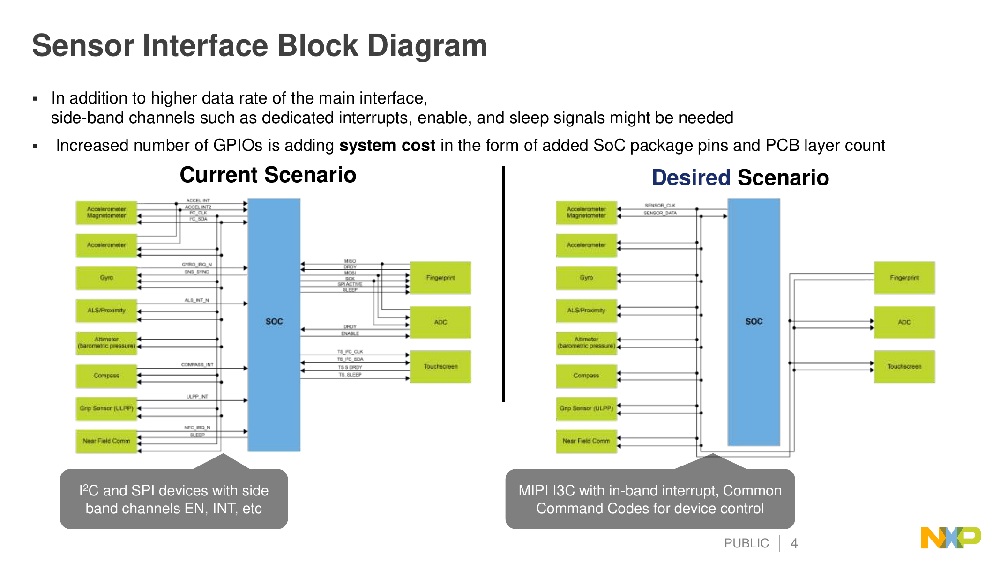

I3C 的基本设计目标可以归纳成四点：

| 目标 | I3C 的做法 | 对驱动/系统的影响 |
|---|---|---|
| 少引脚 | 仍然只用 SCL/SDA 两根线 | 中断、热加入、控制命令进入协议内 |
| 更高速 | SCL 多数时间 push-pull，SDA 数据阶段可 push-pull；SDR 到 12.5 MHz，HDR 更高 | 不能再按纯 I2C open-drain 模型写控制器 |
| 更低功耗 | 减少 open-drain 上拉电流和无效切换 | 需要正确管理 Activity State、事件使能、总线空闲 |
| 更可管理 | 动态地址、CCC、IBI、Hot-Join、多 Controller | 初始化和状态机明显比 I2C 复杂 |

与 I2C/SPI 的高层对比如下：

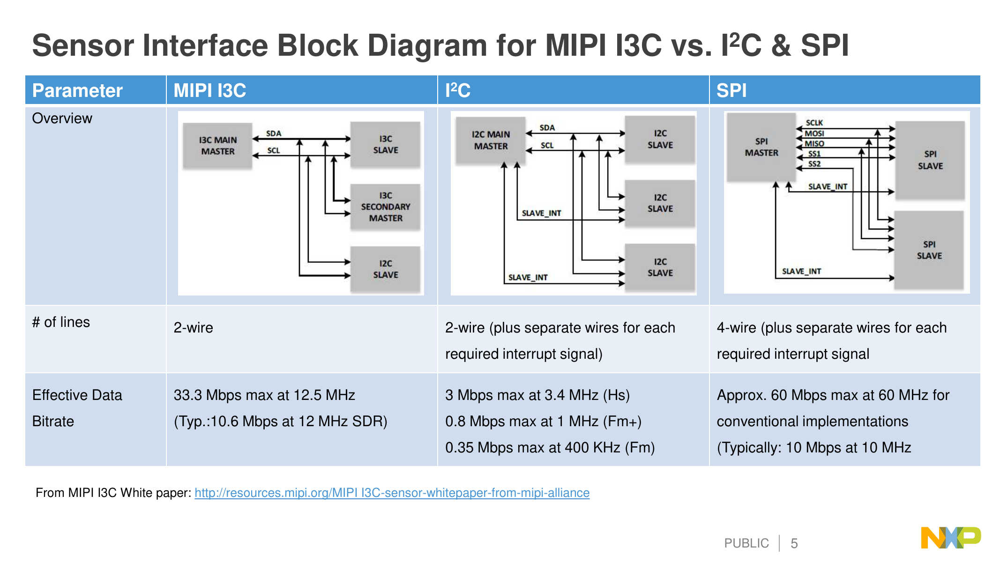

要注意：I3C 兼容的是 **Legacy I2C Target**，不是 I2C Controller。I3C 总线上不能再挂一个传统 I2C Master 参与仲裁。

## 2. I3C 的总线心智模型

I3C 仍然是两线、多点、共享总线，但协议中心从“I2C 风格的主从读写”升级为“当前 Controller 管理一组 Target 的总线系统”。

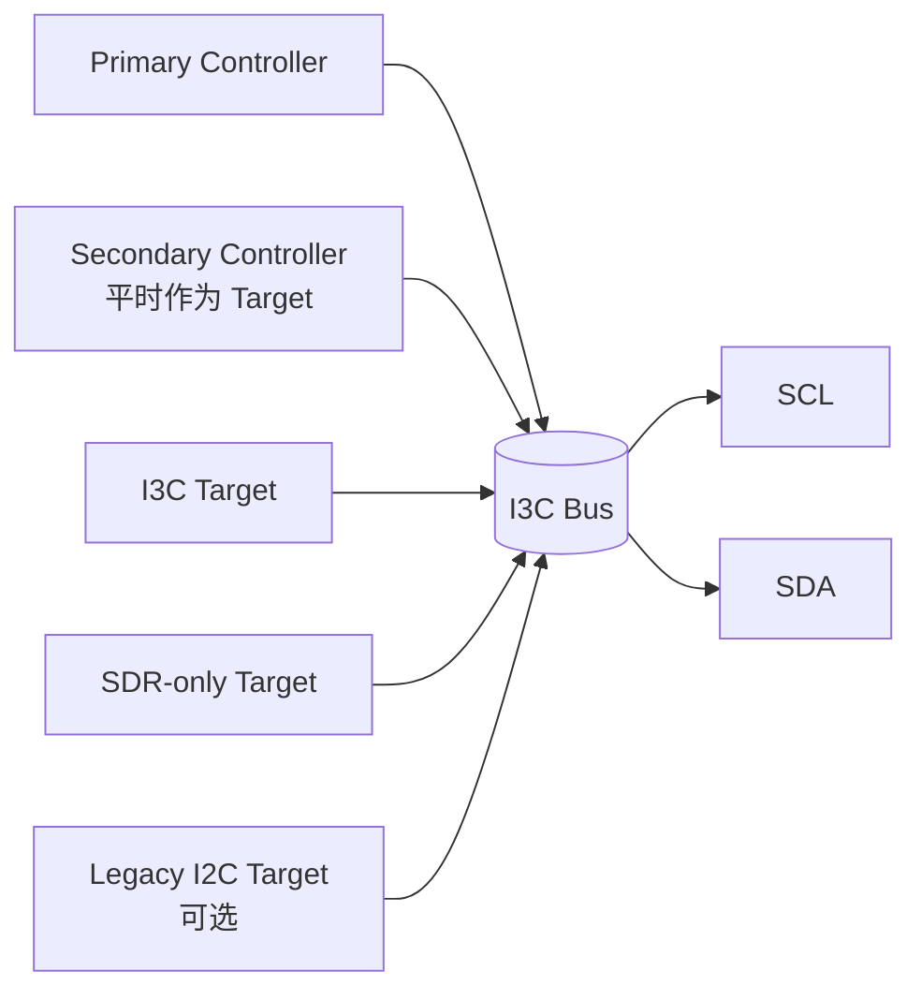

### 2.1 术语变化

MIPI 新版文档推荐使用 `Controller/Target` 替代 `Master/Slave`。在驱动代码和旧 IP 文档里仍可能看到 master/slave，但理解时应映射成：

| 旧术语 | 新术语 | 含义 |
|---|---|---|
| Master | Controller | 控制总线、发 SCL、发起 transfer 的设备 |
| Slave | Target | 响应地址、CCC、读写请求的设备 |
| Current Master | Active Controller | 当前真正控制总线的 Controller |
| Main Master | Primary Controller | 初始化和配置总线的 Controller |
| Secondary Master | Secondary Controller | 有 Controller 能力，但平时作为 Target |

### 2.2 同一时刻只有一个 Active Controller

I3C 支持多 Controller，但不等价于多个 Controller 同时开车。规则是：

```text
Primary Controller 负责初始配置
Secondary Controller 平时作为 Target 存在
需要接管时发 Controller Role Request
Active Controller 批准后进行 Controller Role Handoff
任意时刻总线上只有一个 Active Controller
```

这对驱动框架很关键：I3C host controller driver 不只是传输引擎，还要维护“当前总线拥有者、目标设备表、事件使能、动态地址、IBI 队列、Hot-Join 状态”等总线管理状态。

## 3. 总线配置：Pure、Mixed Fast、Mixed Slow

I3C 的性能和兼容性强依赖总线拓扑。

| 总线类型 | 设备组成 | 关键约束 |
|---|---|---|
| Pure Bus | 只有 I3C 设备 | 最容易发挥 I3C 高速能力 |
| Mixed Fast Bus | I3C + 带 50 ns spike filter 的 Legacy I2C Target | I3C 可用短 SCL high 让 I2C Target 看不见部分 I3C 流量 |
| Mixed Slow/Limited Bus | I3C + 不满足 fast mixed 条件的 Legacy I2C Target | 时钟、HDR、部分优化受限最多 |

驱动 bring-up 时必须回答三个问题：

1. 总线上有没有 Legacy I2C Target？
2. Legacy I2C Target 的地址是否与 I3C 保留地址或动态地址策略冲突？
3. Legacy I2C Target 是否具备 50 ns spike filter，能否进入 Mixed Fast Bus？

## 4. I3C 的地址空间

I3C 仍使用 7-bit 地址，但地址语义比 I2C 更严格。

| 地址 | 用途 |
|---|---|
| `7'h00`、`7'h01` | 保留 |
| `7'h02` | Hot-Join 地址 |
| `7'h7E` | I3C Broadcast Address，CCC 和模式入口核心地址 |
| `7'h7F` | 保留 |
| `7'h3E`、`7'h5E`、`7'h6E`、`7'h76`、`7'h7A`、`7'h7C` | 与 `7'h7E` 单 bit 接近，限制用于提升广播地址错误检测 |
| 其他非冲突地址 | 可作为 I3C 动态地址，仍需避开板上 Legacy I2C 静态地址 |

**工程建议：需要发 IBI 或可能成为 Secondary Controller 的设备，优先分配较低动态地址。**原因是 START 后地址仲裁时，低地址更容易赢；IBI 优先级也和动态地址有关。

## 5. SDR：I3C 的基础控制面

I3C 上电和绝大多数管理动作都从 SDR 开始。即使后续要跑 HDR-DDR 或 HDR-BT，也必须先通过 SDR 完成初始化、能力发现和 Enter HDR CCC。

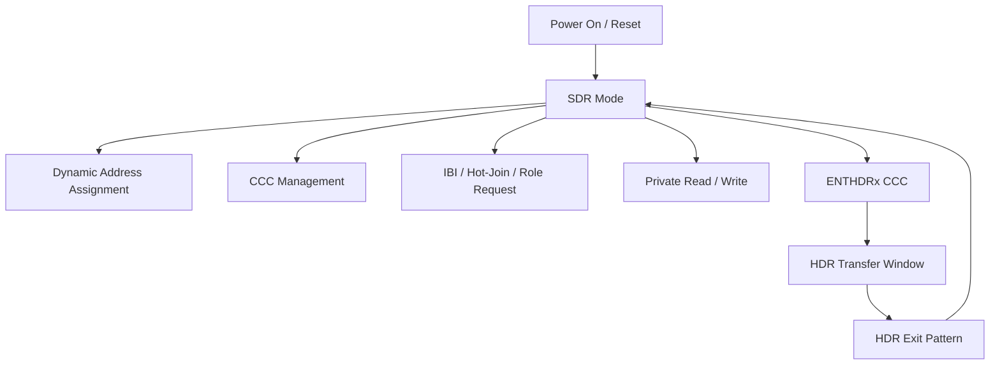

### 5.1 SDR 的外形像 I2C，但第 9 bit 语义不同

SDR 的基本帧仍然是：

```text
START -> Address/Header -> ACK/NACK -> Data Words -> STOP
```

但数据 word 的第 9 bit 已经不是传统 I2C ACK。

| 场景 | I2C 第 9 bit | I3C SDR 第 9 bit |
|---|---|---|
| Controller 写 Target | Target ACK/NACK | Controller 发送 parity T-bit |
| Controller 读 Target | Controller ACK/NACK | Target 发送 T-bit：继续或结束 |
| 地址阶段 | Target ACK/NACK | 仍是 ACK/NACK，open-drain 语义 |

下面这张规范图清楚展示了 I3C 私有读写里 T-bit 的位置。注意图例里写数据 T-bit 是 parity，读数据 T-bit 是 End-of-Data。

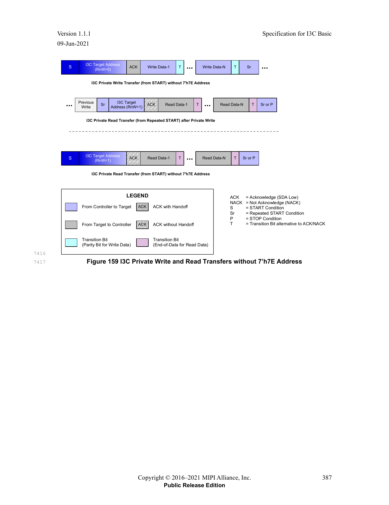

### 5.2 写传输：T-bit 是奇校验

Controller 写 Target 时：

```text
Target Dynamic Address + W + ACK
Data[7:0] + T
Data[7:0] + T
...
```

其中 `T` 是 8-bit data 的奇校验位。用伪代码表达：

```c
/* Odd parity over 8-bit data plus T-bit. */
t_bit = parity_even(data) ? 1 : 0;
```

调波形时不要把写数据后的第 9 bit 当成 Target ACK。如果控制器 IP 或逻辑分析仪还按 I2C 解码，会出现“每个字节 ACK 异常”的误判。

### 5.3 读传输：Target 也能结束读

Controller 读 Target 时：

```text
Target Dynamic Address + R + ACK
Target Data[7:0] + T
Target Data[7:0] + T
...
```

读数据的 T-bit 由 Target 驱动：

| T-bit | 语义 |
|---|---|
| `1` | Target 表示可以继续读 |
| `0` | Target 表示本次 read message 到此结束 |

这正是 I3C 和 I2C 的一个关键差异：I2C 读传输只能由 Master 通过 NACK 结束；I3C SDR 读传输里 Target 可以通过 `T=0` 主动结束。Controller 仍然可以在 Target 表示继续时提前中止，但要按 I3C 的总线接管时序执行。

### 5.4 START 后 Header 可以仲裁

I3C 的 START 后 Header 不是简单的 Controller 地址输出，因为 Target 也可能趁 Bus Available 时发起事件：

```text
IBI               Target 请求中断
Hot-Join          新设备请求加入总线
Controller Role   Secondary Controller 请求接管
```

仲裁仍基于 open-drain 规则：

```text
发送 0：主动拉低 SDA
发送 1：释放 SDA 并观察
如果自己发送 1 但看到 SDA 为 0，说明输掉仲裁
```

Repeated START 后的 Header 通常不再用于这种事件仲裁，Address/RnW 可 push-pull 发送，ACK/NACK 仍保留 open-drain 语义。

## 6. 动态地址分配 DAA

I3C 最重要的管理能力之一是 Dynamic Address Assignment。它解决的是 I2C 静态地址冲突、设备发现困难和上电配置硬编码的问题。

### 6.1 DAA 的输入信息

每个参与 DAA 的 I3C Target 需要能提供可仲裁、可识别的身份信息。典型核心是 48-bit Provisioned ID：

| 字段 | 作用 |
|---|---|
| MIPI Manufacturer ID | 厂商标识 |
| ID Type Selector | 区分随机值或厂商固定值 |
| Part ID | 器件型号或部件标识 |
| Instance ID | 多实例区分 |
| Extra / Vendor bits | 厂商自定义 |

实际驱动不应假设“地址固定等于某个设备”。正确做法是通过 DAA 后的设备表、PID/BCR/DCR 和板级描述共同建立枚举关系。

### 6.2 典型初始化流程

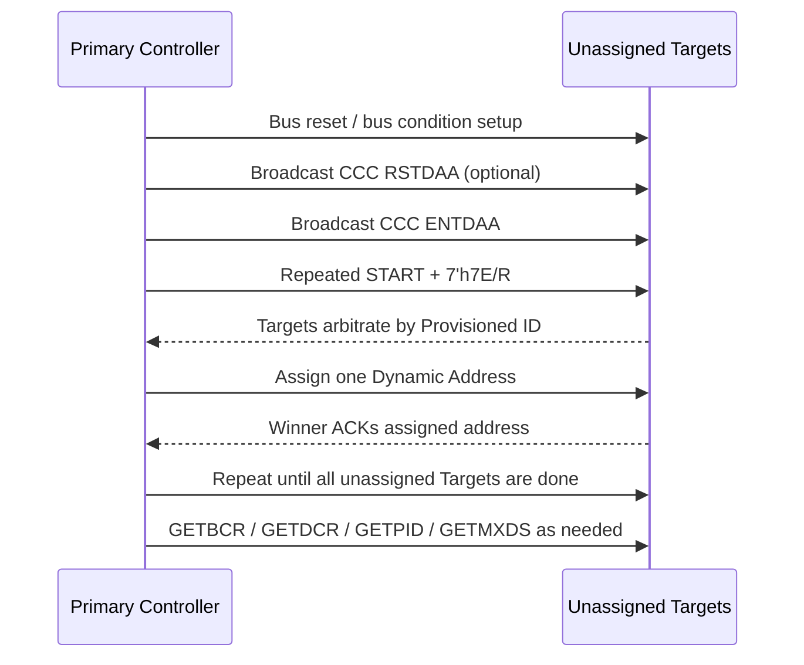

### 6.3 DAA 的驱动实现要点

1. DAA 不是一次性“扫地址”，而是通过 Target 身份仲裁逐个分配动态地址。
2. 分配策略要避开 `7'h7E` 及相关保留/限制地址，也要避开 Legacy I2C 静态地址。
3. 如果设备需要较高 IBI 优先级，可以在地址分配策略上给它更低动态地址。
4. DAA 完成后要读取 BCR/DCR/PID 等能力信息，建立软件设备表。
5. 每次总线 reset、Target reset、Controller crash recovery 后，都要重新评估动态地址是否仍有效。

## 7. CCC：I3C 的总线管理命令通道

CCC 是 Common Command Code。可以把它理解成 I3C 的“协议内控制面命令集”。很多 I3C 能力都不是私有寄存器访问，而是 CCC。

### 7.1 Broadcast CCC 和 Direct CCC

| 类型 | 地址入口 | 作用 |
|---|---|---|
| Broadcast CCC | `7'h7E + W` | 面向所有 I3C Target，例如 `ENTDAA`、`RSTDAA`、`ENTHDRx` |
| Direct CCC | 先 `7'h7E + W` 发 CCC，再用目标动态地址访问 | 面向某个 Target，例如 `GETPID`、`GETBCR`、`GETDCR` |

Direct CCC 的典型结构如下：

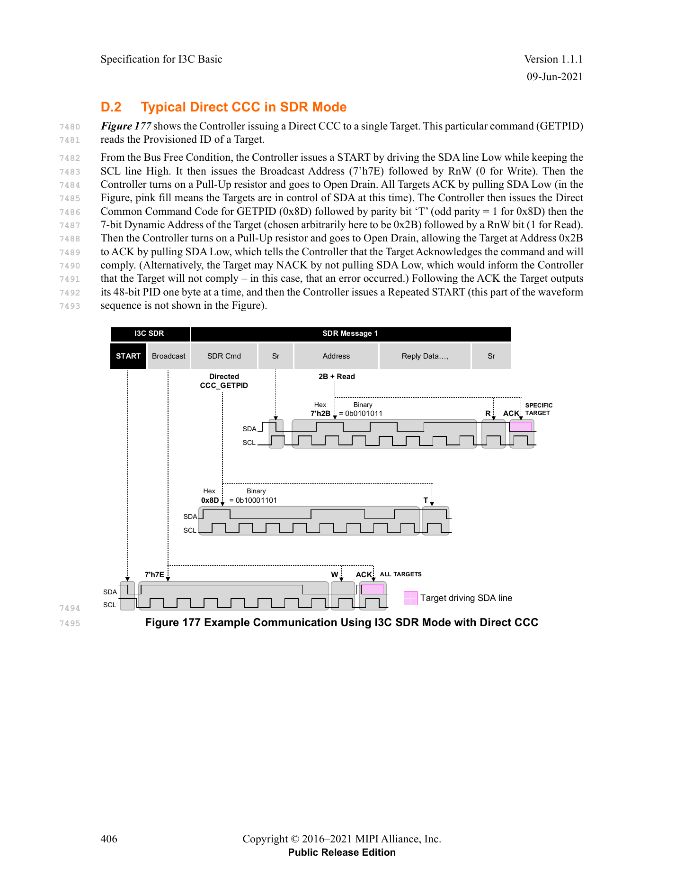

Broadcast CCC 的典型结构如下：

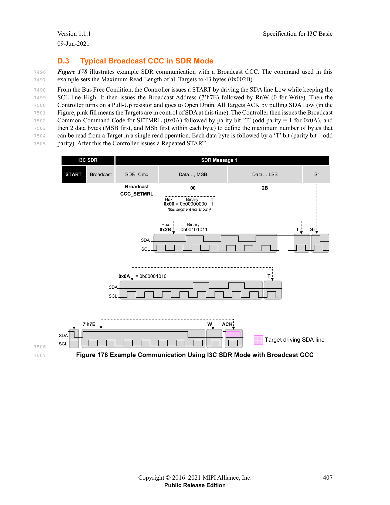

### 7.2 常用 CCC 分类

| 类别 | 代表命令 | 作用 |
|---|---|---|
| 地址管理 | `ENTDAA`、`RSTDAA`、`SETDASA`、`SETNEWDA` | 动态地址分配和变更 |
| 事件管理 | `ENEC`、`DISEC` | 使能/禁用 IBI、Hot-Join、Controller Role Request |
| 能力查询 | `GETPID`、`GETBCR`、`GETDCR`、`GETMXDS`、`GETCAPS` | 枚举 Target 能力 |
| 传输限制 | `SETMWL`、`SETMRL`、`GETMWL`、`GETMRL` | 最大读写长度 |
| HDR 入口 | `ENTHDR0`、`ENTHDR3` 等 | 从 SDR 进入 HDR 模式 |
| 多 Controller | `GETACCCR`、`DEFTGTS` | Controller role handoff 和 Target 表同步 |
| 复位/恢复 | `RSTACT`、Target Reset Pattern | Target reset 和恢复 |

### 7.3 CCC 的实现边界

驱动里容易犯的错误是把 CCC 当成普通 write/read transfer。CCC 需要单独建模，原因是：

1. CCC 入口通常固定从 `7'h7E` 开始。
2. Direct CCC 可能包含“先广播命令码，再 repeated START 到目标地址”的复合帧。
3. 不同 CCC 的 payload 长度、方向、是否 broadcast/direct 都不一样。
4. 某些 CCC 会改变总线全局状态，例如 DAA、HDR 入口、事件使能。
5. HDR 模式下可用 CCC 是受限集合，不应假设 SDR CCC 都能在 HDR 中使用。

## 8. IBI：带内中断

IBI 是 In-Band Interrupt。它的价值是去掉每个 Target 的外部中断引脚，让 Target 通过 I3C 总线本身请求 Controller 服务。

### 8.1 IBI 基本流程

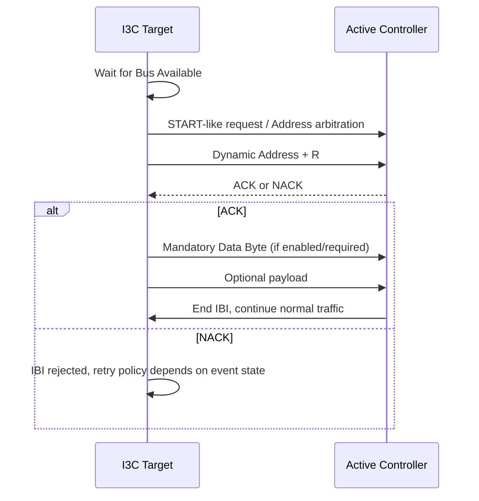

IBI 的优先级通常由动态地址仲裁体现：动态地址越低，越容易赢得 START 后仲裁。因此中断密集或时延敏感的 Target，地址分配策略上应放在低地址区域。

### 8.2 Mandatory Data Byte

部分 Target 的 IBI 带 Mandatory Data Byte，用来告诉 Controller 中断类型或目标内部状态。驱动里要先根据 BCR/设备能力判断 IBI 是否带 MDB，不能所有 IBI 都按同一个长度处理。

### 8.3 IBI 调试重点

1. 是否通过 `ENEC` 使能了 Target event？
2. Target 的动态地址是否过高，导致多 IBI 仲裁时优先级不符合预期？
3. Controller NACK IBI 后，软件是否错误地认为中断已经被处理？
4. IBI payload 长度和 MDB 解析是否匹配设备 BCR/私有协议？
5. 当前是否处在 HDR transfer window 中？IBI 通常依赖 SDR 管理事件，不能随意插入 HDR 内部。

## 9. Hot-Join：运行中加入总线

Hot-Join 允许 Target 在总线已经初始化后请求加入。例如设备刚上电、模块热插入、或者某个电源域后启动。

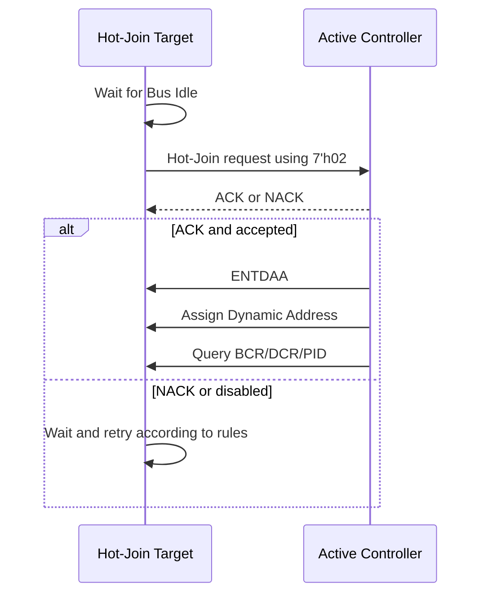

Hot-Join 对软件框架的影响很直接：I3C bus 不能被看作“probe 时固定完成枚举”的静态总线。驱动需要支持运行时新增 Target、重新分配动态地址、更新设备表，并避免在 transfer 进行中破坏当前 frame。

## 10. Controller Role Handoff

多 Controller 是 I3C 的高级能力。Secondary Controller 平时作为 Target，必要时通过 Controller Role Request 请求成为 Active Controller。

```text
Secondary Controller 发起 Role Request
Active Controller 识别并决定是否允许
Active Controller 通过 CCC/流程同步目标列表和总线配置
总线控制权交给 Secondary Controller
Secondary Controller 完成事务后归还或继续按规则管理
```

驱动实现时至少要区分：

| 状态 | 软件含义 |
|---|---|
| 本控制器是 Primary Controller | 负责初始化、DAA、默认总线管理 |
| 本控制器是 Active Controller | 可以发起当前 transfer |
| 本控制器是 Secondary Controller/Target | 不能直接抢 SCL，需要按 role request 流程 |
| Handoff in progress | 需要冻结普通 transfer 队列，避免总线状态错乱 |

如果 SoC/系统永远只有一个 Controller，可以先把 role handoff 作为 unsupported capability 明确屏蔽，但不能让硬件误响应相关事件。

## 11. HDR：高速数据面

HDR 是 High Data Rate。它不是替代 SDR 的新总线初始化模式，而是 **从 SDR 进入、在专用窗口内传输、再退出回 SDR** 的高速数据面。

```text
SDR:
  START -> 7'h7E + W -> ENTHDRx + T

HDR:
  HDR command/header
  HDR data
  CRC / parity
  HDR Restart 或 HDR Exit

SDR:
  STOP 或继续 SDR traffic
```

I3C Basic v1.1.1 中最需要关注的是：

| HDR 模式 | 入口 CCC | 核心模型 | 适用场景 |
|---|---|---|---|
| HDR-DDR | `ENTHDR0` | 双沿传输，Command/Data/CRC Word | 中等长度高速读写 |
| HDR-BT | `ENTHDR3` | Bulk Transport，Header/Data Block/CRC Block | 大块数据搬运，适合 FIFO/DMA 模型 |

完整 I3C 规范里的 HDR-TSP/HDR-TSL 不属于 I3C Basic 支持范围。

### 11.1 HDR-DDR

HDR-DDR 的关键点：

1. 通过 SDR `ENTHDR0` 进入。
2. SDA 在 SCL 的上升沿和下降沿都承载数据。
3. 传输单位是 HDR-DDR Word，包含 preamble、data、parity/CRC 等结构。
4. 可用 HDR Restart 继续下一笔 HDR transfer，也可用 HDR Exit 回到 SDR。

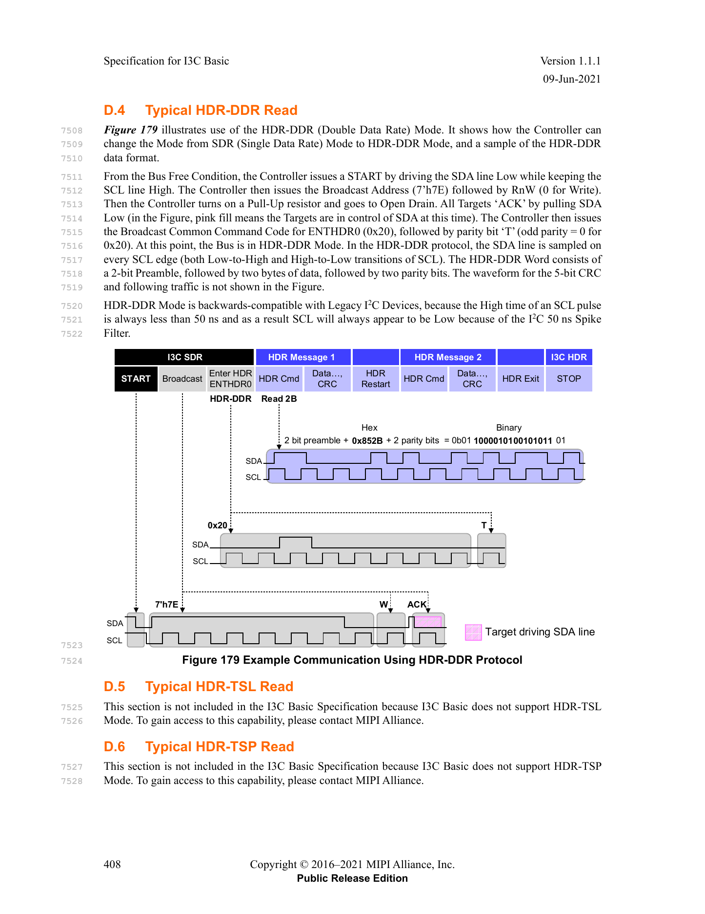

驱动实现上，HDR-DDR 不能复用普通 SDR byte FIFO 模型。它更接近“word command + data word stream + CRC”的专用传输模式。

### 11.2 HDR-BT

HDR-BT 是 Bulk Transport，面向更大的数据块：

1. 通过 SDR `ENTHDR3` 进入。
2. 先发送 Header Block，描述方向、地址、控制信息、lane 等。
3. 后续是一个或多个 Data Block。
4. 结尾使用 CRC Block。
5. 可支持多 lane 模型，适合高吞吐搬运。

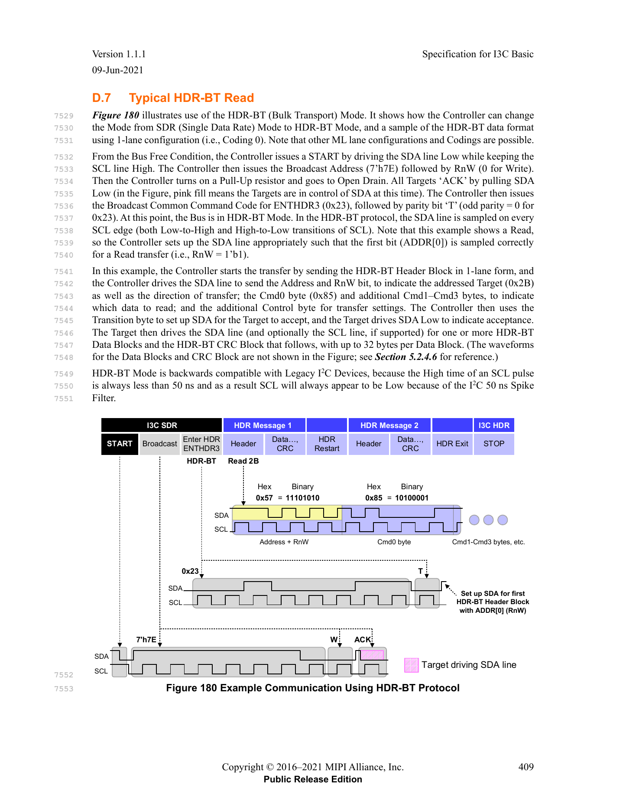

驱动视角下，HDR-BT 更适合与 DMA、FIFO watermark、burst 长度、缓存一致性策略一起设计。不要把它理解成“更快的 SDR read/write”。

### 11.3 HDR 和事件的关系

IBI、Hot-Join、Controller Role Request 本质上是 SDR 管理事件。进入 HDR 后，Target 即使不支持当前 HDR 模式，也必须能识别 HDR Exit Pattern，至少能等总线回到 SDR。实现上要注意：

1. 不要在 HDR 中执行 DAA。
2. 不要假设 Target 可在 HDR 内随时发 IBI。
3. 进入 HDR 前要确认目标 Target 支持对应 HDR 模式。
4. HDR 异常退出后要恢复到可预测 SDR 状态，必要时做 bus recovery。

## 12. 错误检测和恢复

I3C 的错误处理比 I2C 更系统。SDR 写数据有 parity，HDR 有 parity/CRC，Controller 和 Target 对不同错误有不同恢复责任。

常见错误类别可以按工程视角归纳：

| 错误类型 | 可能原因 | 软件处理方向 |
|---|---|---|
| Parity 错误 | SDR 写数据 T-bit 错、采样边沿异常、信号完整性问题 | 记录目标地址和 byte offset，必要时重试 |
| CRC 错误 | HDR 数据错误、lane 配置错误、时序/电气问题 | 丢弃当前 HDR transfer，回到 SDR 后恢复 |
| NACK | Target 不存在、不支持 CCC、忙、错误状态 | 区分地址 NACK、CCC NACK、data NACK |
| SDA stuck | Target 未释放 SDA、reset 中断、上电时序异常 | 执行控制器 bus recovery 或 Target reset |
| DAA collision/失败 | PID 冲突、Target 实现异常、地址分配冲突 | 重试 DAA，必要时隔离设备 |
| IBI storm | Target 事件未清、MDB 解析错误、驱动未处理源状态 | 禁用事件、读取状态、清中断后再使能 |

### 12.1 Clock Stall 不是 I2C Clock Stretch

I3C 中 SCL 通常由 Controller push-pull 驱动。Target 不像 I2C 那样随意 clock stretching。规范允许 Controller 在某些阶段延长 SCL low：

| 场景 | 典型用途 |
|---|---|
| ACK/NACK 阶段 | 给 Controller/Target 状态机留处理时间 |
| 写数据 parity bit | 等待校验或 FIFO |
| 读数据 T-bit | 处理继续/结束和总线接管 |
| DAA 分配地址首 bit | 给动态地址分配流程留更长响应时间 |

驱动调试时如果看到 SCL low 被拉长，先判断是不是 Controller 合法 stall，而不是按 I2C 思维直接怀疑 Target clock stretch。

## 13. 驱动实现建议

### 13.1 软件模块划分

一个可维护的 I3C Controller driver 至少应拆出以下概念：

| 模块 | 责任 |
|---|---|
| Bus Manager | 总线初始化、DAA、设备表、地址策略 |
| Transfer Engine | SDR private transfer、CCC transfer、HDR transfer |
| Event Manager | IBI、Hot-Join、Controller Role Request |
| Device Model | PID/BCR/DCR、动态地址、静态地址、能力缓存 |
| Recovery | bus reset、Target reset、SDA stuck、DAA retry |
| Power/Activity | ENTASx、事件开关、runtime PM |

### 13.2 初始化伪流程

```text
1. 初始化 Controller IP、pinmux、时钟、FIFO/DMA
2. 置总线到已知空闲状态，处理可能的 SDA stuck
3. 加载板级 Legacy I2C Target 信息和限制
4. 规划动态地址池，避开保留地址和 Legacy I2C 地址
5. 对有静态地址的 I3C Target 可先 SETDASA
6. 对未知 I3C Target 执行 ENTDAA
7. 对每个 Target 读取 GETPID/GETBCR/GETDCR/GETMXDS/GETCAPS
8. 注册 I3C device，绑定上层 function driver
9. 根据需求 ENEC 使能 IBI/Hot-Join/CRR
10. 正常处理 SDR/HDR transfer 和 runtime event
```

### 13.3 Transfer API 不要照搬 I2C

I2C 常见 API 是 `addr + flags + len + buf`。I3C 如果完全照搬，会很快遇到表达力不足：

| I3C 需求 | 为什么 I2C API 不够 |
|---|---|
| CCC | 需要表达 broadcast/direct、命令码、payload 方向 |
| DAA | 不是普通地址扫描 |
| IBI | 不是被动读，是 Target 发起事件 |
| HDR | word/block/CRC/lane 结构不同 |
| Target 主动结束 read | read length 可能不是 Controller 完全预知 |
| Dynamic Address | 地址是运行时资源，不是固定硬件属性 |

建议在驱动内部明确区分：

```text
i3c_sdr_priv_xfer
i3c_ccc_xfer
i3c_daa
i3c_ibi_enable / disable / handle
i3c_hdr_xfer
i3c_bus_recovery
```

## 14. Bring-up 和调试检查表

### 14.1 上电后先确认电气和拓扑

- SCL/SDA 空闲电平是否为 high
- 上拉和 high-keeper 配置是否符合板级设计
- Legacy I2C Target 是否存在，地址是否冲突
- I2C Target 是否带 50 ns spike filter，决定 mixed bus 能力
- Controller 是否正确配置 open-drain/push-pull 切换

### 14.2 DAA 不通时

- 是否有 Target 支持至少一种动态地址分配方式
- `7'h7E` broadcast 是否被所有 I3C Target ACK
- PID 仲裁阶段 SDA 是否有多个 Target 同时驱动
- 分配地址是否落入保留/限制/冲突范围
- Target ACK assigned dynamic address 是否正常
- 失败后是否残留半分配状态，需要 RSTDAA 或 bus reset

### 14.3 CCC 不通时

- CCC 是 broadcast 还是 direct
- Direct CCC 是否正确执行 `7'h7E + CCC + Sr + Target Address`
- Payload 方向和长度是否匹配规范
- 写数据 T-bit parity 是否正确
- Target 是否 NACK 了不支持的 CCC
- 当前模式是否允许该 CCC

### 14.4 IBI 不通时

- 是否对 Target 执行 ENEC 使能事件
- BCR 是否表明支持 IBI 和 MDB
- Controller 是否打开 IBI 接收队列/中断
- IBI 地址仲裁是否输给其他事件
- Controller NACK 后 Target 的重试策略是否被正确处理
- 上层 function driver 是否及时清除 Target 内部中断源

### 14.5 HDR 不通时

- Target 是否通过 GETMXDS/GETCAPS 表示支持对应 HDR 模式
- 是否从 SDR 通过正确 ENTHDRx 进入
- HDR Restart 和 HDR Exit Pattern 是否被所有 Target 正确识别
- DDR 双沿采样时序是否满足控制器和板级约束
- CRC/parity 错误是否能恢复到 SDR
- DMA/FIFO 数据粒度是否匹配 HDR-DDR word 或 HDR-BT block

## 15. 最容易踩的坑

1. **把 I3C 当成更快的 I2C。** I3C 真正复杂的是总线管理和事件模型，不只是时钟更快。
2. **把 SDR 写数据第 9 bit 当 ACK。** 写数据第 9 bit 是 Controller 发的 parity T-bit。
3. **把 SDR 读数据长度看作 Controller 单方面决定。** Target 可以通过 T-bit 主动结束读。
4. **动态地址硬编码。** 动态地址是运行时分配结果，不能当成设备固定身份。
5. **忽略 `7'h7E`。** Broadcast Address 是 CCC、DAA、Enter HDR 的核心入口。
6. **在 HDR 里做管理动作。** DAA、Hot-Join、IBI、Role Request 等主线仍在 SDR 管理面。
7. **没有区分 open-drain 和 push-pull 阶段。** ACK/仲裁、数据、Repeated START 后 Header 的驱动方式不同。
8. **Legacy I2C 兼容性只看地址。** 还要看 spike filter、LVR、总线速度和 I3C 流量可见性。
9. **IBI 没有背压策略。** 高频 IBI 设备需要地址优先级、队列和上层清源配合。
10. **Recovery 设计不足。** I3C 比 I2C 更依赖控制器状态机，异常后要能回到可预测 SDR 状态。

## 16. 建议的组内分享节奏

| 时间 | 内容 |
|---|---|
| 5 min | 背景：为什么 I3C 解决的是系统 pin/GPIO/功耗问题 |
| 10 min | 总线模型：Controller/Target、Pure/Mixed Bus、地址空间 |
| 20 min | SDR 核心：Header 仲裁、T-bit、DAA、CCC |
| 15 min | 事件机制：IBI、Hot-Join、Controller Role Request |
| 10 min | HDR：HDR-DDR、HDR-BT、为什么它是高速数据面 |
| 15 min | 驱动实现：模块划分、初始化流程、调试检查表 |
| 10 min | Q&A：结合当前 IP、板级拓扑和验证计划 |

## 17. 参考材料

- `mipi_I3C-Basic_specification_v1-1-1.pdf`：MIPI I3C Basic Specification v1.1.1，Public Release Edition。
- `2026-06-06-i3c-basic-spec-v1-1-1.md`：由规范 PDF 转写的全文 Markdown。
- `MIPI_I3C中文文档_1616318682792.pdf` 与 `2026-06-06-mipi-i3c-chinese-doc.md`：中文转写材料。
- `AMF-DES-T2686.pdf` 与 `2026-06-06-mipi-i3c-introduction.md`：NXP I3C introduction，适合做背景和架构引入。
- `第三章讲解.md`、`第四章讲解.md`、`第四章节第二部分讲解.md`：当前目录下已有章节学习笔记。
- `Broadcast CCC典型用法.md`、`Slave终止read能力解析.md`：针对 CCC 和 T-bit/读终止语义的专题笔记。
