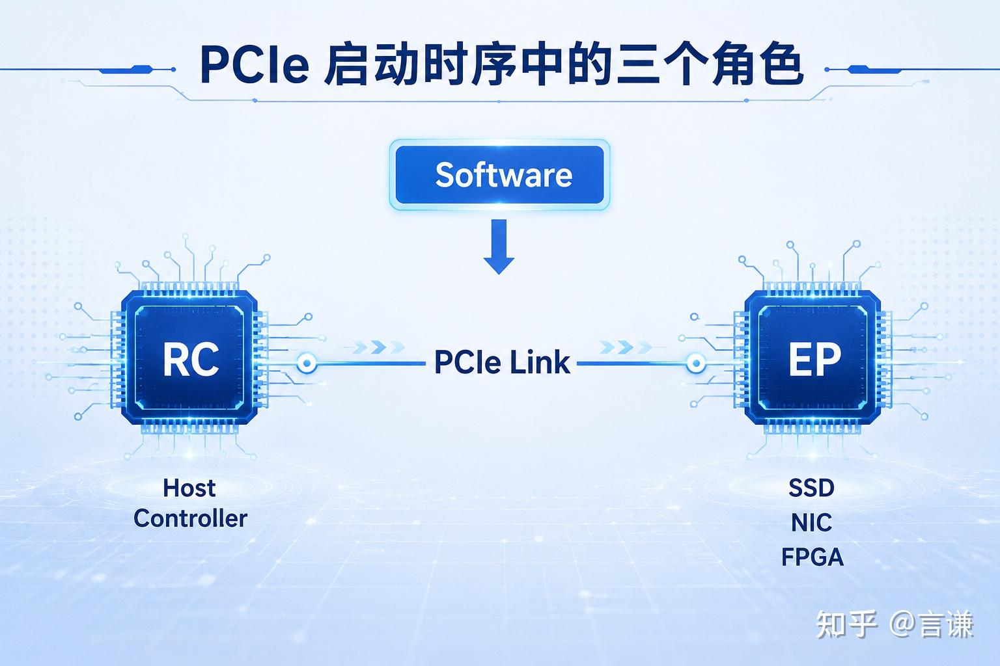
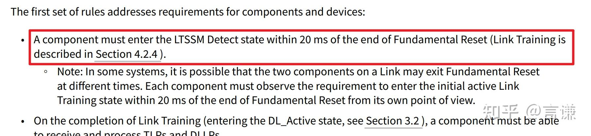
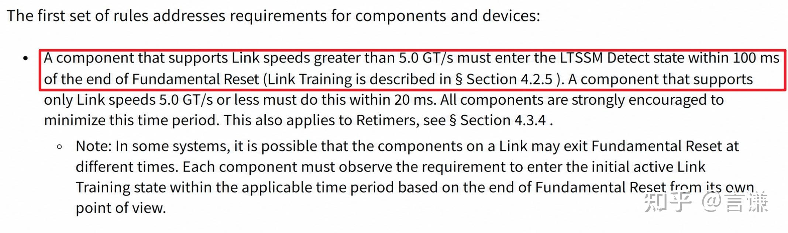
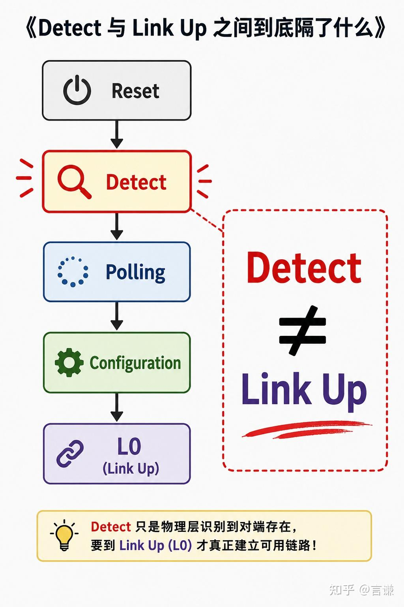
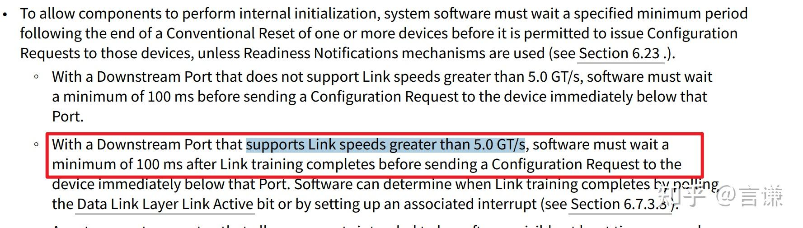
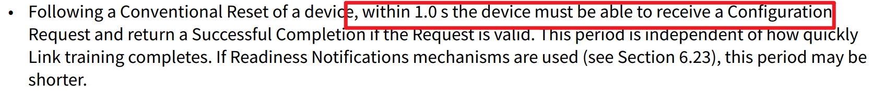
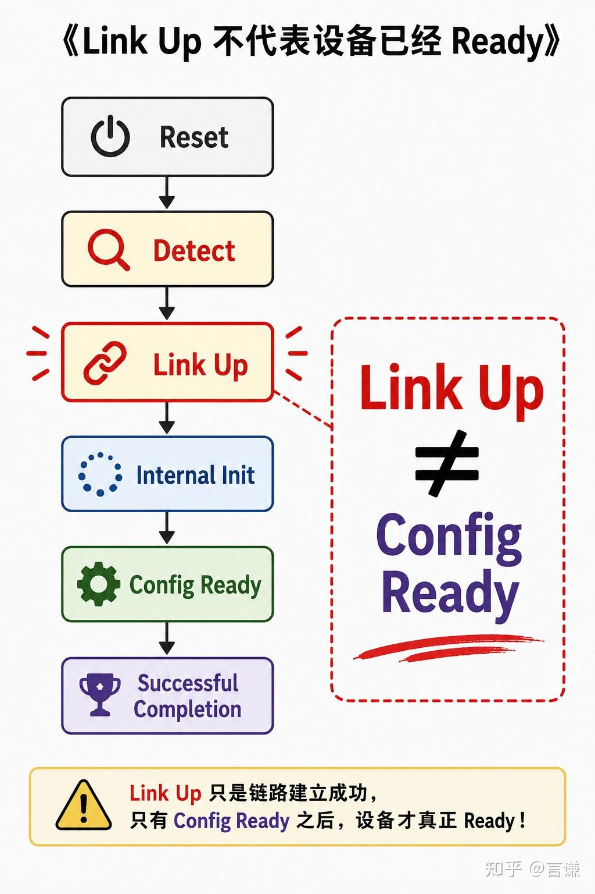
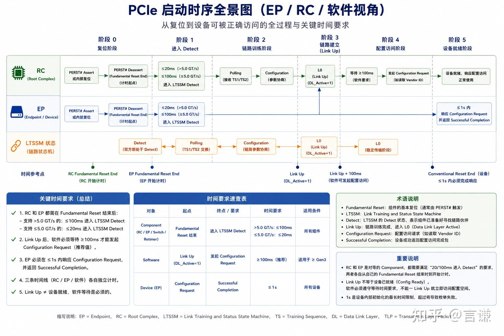

# Linux 启动 5 秒后才 Link Up，PCIe 为什么没有超时？

前段时间调试 PCIe 时，我盯着串口日志看了半天，突然意识到一个以前从来没认真想过的问题。

系统启动流程大概是这样的：

```c
BootROM
 ↓
FSBL
 ↓
OpenSBI
 ↓
Linux
 ↓
PCIe Driver Probe
 ↓
Link Up
```

从上电到 PCIe Driver Probe，中间已经过去了好几秒。

但 SSD 还是正常枚举了。

网卡还是正常识别了。

一切看起来都很正常。

可问题来了。

我以前一直以为：

> PCIe 必须在 100ms 内完成 Link Up。

如果真是这样，那么 Linux 阶段才启动 PCIe，不是早就超时了吗？

带着这个疑问，我重新翻了一遍 PCIe Base Specification。

结果发现：

我以前理解错的不是某个寄存器，不是某条状态机，而是整个问题。

## 我们可能一直在讨论不同的东西

网上讨论 PCIe 启动时序，经常会看到下面这些说法：

```text
20ms

100ms

1s
```

然后各种结论满天飞：

```text
PCIe要20ms建链

PCIe要100ms建链

PCIe设备1秒Ready
```

第一次看这些资料的时候，我也觉得很合理。

直到后来发现一个奇怪现象：

有的人在讲 Endpoint。

有的人在讲 Root Complex。

有的人在讲操作系统。

结果所有时间要求最后都被揉成一句：

> PCIe 必须在 XX ms 内完成。

问题就出在这里。

PCIe 规范里的时间要求，压根不是在约束同一个对象。

## 先别急着看时间，先看是谁在计时

后来我把规范里所有涉及启动时序的内容重新整理了一遍。

发现 PCIe 里面其实有三个角色。

第一个是：

```text
Endpoint（EP）
```

例如：

- SSD
- 网卡
- FPGA卡

第二个是：

```text
Root Complex（RC）
```

例如：

- CPU里的PCIe Controller
- SoC里的PCIe Host

第三个是：

```text
System Software
```

例如：

- BIOS
- UEFI
- RC驱动



## 第一个误区：Detect 不等于 Link Up

我以前一直以为：

```text
Reset
 ↓
Link Up
```

实际上 LTSSM 根本不是这么工作的。

真正流程是：

```text
Reset
 ↓
Detect
 ↓
Polling
 ↓
Configuration
 ↓
L0
```

而：

```text
L0
```

才是真正意义上的：

```text
Link Up
```

Detect 只是：

> 我已经准备好了，可以开始寻找对端。

它甚至不代表链路训练已经开始。

更不代表链路已经建立。

这时候再回头看规范里的要求：

```text
20ms进入Detect
```

或者：

```text
>5GT/s

100ms进入Detect
```

突然就清楚了。

规范要求的是：

```text
进入Detect
```

而不是：

```text
完成Link Up
```

这两者差了整整一个链路训练过程。



20ms detect



100ms detect



## 第二个误区：100ms 其实不是给 EP 的

继续往下翻规范。

我发现一个更容易被误解的地方。

很多人都知道规范里面有一个：

```text
100ms
```

但很少有人注意：

这个 100ms 到底约束谁。

规范原文大意是：

> Link Training 完成后，Software 必须等待至少 100ms，才能向设备发送 Configuration Request。



第一次看到这里，我愣了一下。

因为这句话的主语不是：

```text
EP
```

也不是：

```text
RC
```

而是：

```text
Software
```

换句话说。

规范真正要求的是：

```text
Link Up
 ↓
等待100ms
 ↓
Config Request
```

约束对象是：

```text
Linux

UEFI

BIOS
```

而不是 SSD。

更不是网卡。

这也是为什么：

```text
100ms
```

和：

```text
Link Up
```

根本不是同一个概念。

一个约束的是：

```text
软件什么时候可以访问设备
```

一个描述的是：

```text
链路什么时候建立成功
```

## 第三个误区：1 秒也不是 Link Up 时间

看到这里，我原本以为已经搞明白了。

结果继续翻规范，又看到了：

```text
1.0 second
```

第一次看到时，我下意识理解成：

```text
1秒内完成Link Up
```

后来发现又错了。

规范真正写的是：

> Device must be able to receive a Configuration Request and return a Successful Completion.



注意这里出现的关键词：

```text
Configuration Request

Successful Completion
```

而不是：

```text
Detect

Link Up
```

这句话真正的意思其实是：

假设设备已经经历了一次 Reset。

那么最迟在 1 秒内：

```text
Host
```

发起：

```text
Cfg Read Vendor ID
```

设备必须能够返回：

```text
Completion
```

不能一直超时。

注意这里其实隐含一个前提。

如果 Host 已经能够发送：

```text
Configuration Request
```

那么说明：

```text
链路大概率早就已经起来了。
```

所以：

```text
1秒
```

约束的其实不是：

```text
Link Up
```

而是：

```text
Config Ready
```



## 这才是 Linux 阶段启动 PCIe 仍然正常的原因

重新理解这些概念之后。

文章开头那个问题终于解释通了。

很多 SoC 平台里面：

```text
BootROM
FSBL
OpenSBI
Linux
```

运行期间。

PCIe Controller 可能一直处于 Reset 状态。

直到 Linux Driver Probe：

```text
deassert_reset();

start_ltssm();
```

之后。

RC 才真正开始进入 LTSSM。

因此规范里的：

```text
20ms

100ms
```

计时起点其实是：

```text
Controller Reset Release
```

而不是：

```text
系统上电
```

所以：

```text
系统启动5秒
```

和：

```text
PCIe Detect要求20ms/100ms
```

根本不是同一件事。

## 写在最后

这次重新翻 PCIe 规范，最大的收获不是搞清楚了 20ms、100ms 还是 1 秒。

而是发现自己以前一直把三个完全不同的问题混在了一起：

```text
EP什么时候进入Detect？

Software什么时候发Config Request？

Device什么时候真正Ready？
```

这三个问题对应三类不同角色：

```text
EP

RC

Software
```

也对应三条不同时间线。

很多关于 PCIe 启动时序的争论，本质上都来自于把这三条时间线混成了一条。

而当你把角色和时间线分开之后，会发现：

> PCIe 规范从来没有简单地要求“100ms 内完成 Link Up”。

真正复杂的，从来不是数字，而是谁在计时。

