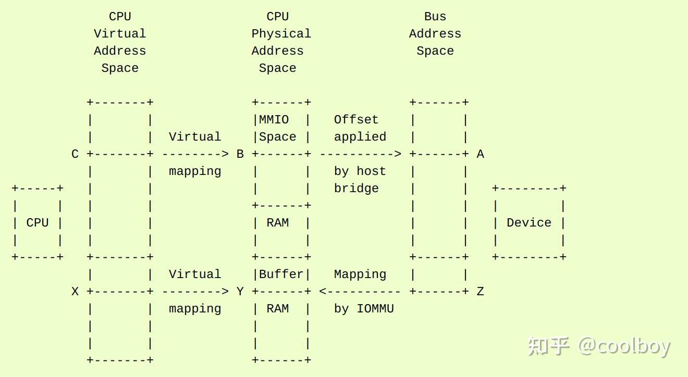

# linux DMA API 使用指导

这是设备驱动程序编写者关于如何使用带有示例伪代码的 DMA API 的指南。有关 API 的简明描述，请参阅 DMA-API.txt。

### CPU 和 DMA 地址

DMA API 涉及多种地址，了解它们的区别很重要。内核通常使用虚拟地址。 kmalloc()、vmalloc() 和类似接口返回的任何地址都是虚拟地址，可以存储在 void *.虚拟内存系统（TLB、页表等）将虚拟地址转换为 CPU 物理地址，存储为“phys_addr_t”或“resource_size_t”。内核将寄存器等设备资源作为物理地址进行管理。这些是 /proc/iomem 中的地址。物理地址对驱动程序没有直接用处；它必须使用 ioremap() 来映射空间并产生一个虚拟地址。I/O 设备使用第三种地址：“总线地址”。如果设备在 MMIO 地址上有寄存器，或者如果它执行 DMA 来读取或写入系统内存，则设备使用的地址是总线地址。在某些系统中，总线地址与 CPU 物理地址相同，但通常情况并非如此。 IOMMU 和主机桥可以在物理地址和总线地址之间产生任意映射。从设备的角度来看，DMA 使用总线地址空间，但它可能仅限于该空间的子集。例如，即使系统支持主存和 PCI BAR 的 64 位地址，它也可能使用 IOMMU，因此设备只需要使用 32 位 DMA 地址。这是一张图片和一些例子：



在枚举过程中，内核了解 I/O 设备及其 MMIO 空间以及将它们连接到系统的主机桥。例如，如果一个 PCI 设备有一个 BAR，内核从 BAR 读取总线地址 (A) 并将其转换为 CPU 物理地址 (B)。地址 B 存储在结构资源中，通常通过 /proc/iomem 公开。当驱动程序声明设备时，它通常使用 ioremap() 将物理地址 B 映射到虚拟地址 (C)。然后它可以使用例如 ioread32(C) 来访问总线地址 A 处的设备寄存器。如果设备支持 DMA，则驱动程序使用 kmalloc() 或类似接口设置缓冲区，该接口返回虚拟地址 (X)。虚拟内存系统将 X 映射到系统 RAM 中的物理地址 (Y)。驱动程序可以使用虚拟地址 X 访问缓冲区，但设备本身不能，因为 DMA 不通过 CPU 虚拟内存系统。在一些简单的系统中，设备可以直接对物理地址 Y 进行 DMA。但在许多其他系统中，有 IOMMU 硬件将 DMA 地址转换为物理地址，例如，它将 Z 转换为 Y。这是 DMA 的部分原因API：驱动程序可以将虚拟地址 X 提供给 dma_map_single() 之类的接口，该接口设置任何所需的 IOMMU 映射并返回 DMA 地址 Z。然后驱动程序告诉设备对 Z 进行 DMA，IOMMU 将其映射到系统 RAM 中地址 Y 处的缓冲区。为了让 Linux 能够使用动态 DMA 映射，它需要一些驱动程序的帮助，即它必须考虑到 DMA 地址应该只在它们实际使用的时候被映射，而在 DMA 传输之后被取消映射。当然，即使在不存在此类硬件的平台上，以下 API 也可以工作。请注意，DMA API 适用于任何独立于底层微处理器架构的总线。您应该使用 DMA API 而不是特定于总线的 DMA API，即使用 dma_map_*() 接口而不是 pci_map_*() 接口。首先，您应该确保：

```text
#include <linux/dma-mapping.h>
```

在您的驱动程序中，它提供了 dma_addr_t 的定义。此类型可以保存平台的任何有效 DMA 地址，并且应该在您保存从 DMA 映射函数返回的 DMA 地址的任何地方使用。

### 什么内存可以 DMA？

您必须知道的第一条信息是 DMA 映射工具可以使用哪些内核内存。对此有一套不成文的规则，本文试图最终将它们写下来。如果您通过页面分配器（即 __get_free_page*()）或通用内存分配器（即 kmalloc() 或 kmem_cache_alloc()）获取内存，那么您可以使用从这些例程返回的地址对内存进行 DMA 访问。这意味着您可以_不_使用从 vmalloc() 返回的内存/地址用于 DMA。可以 DMA 到映射到 vmalloc() 区域的 _underlying_ 内存，但这需要遍历页表以获取物理地址，然后使用 __va() 之类的东西将这些页面中的每一个转换回内核地址。 [ 编辑：当我们集成 Gerd Knorr 的通用代码时更新这个。 ]这条规则还意味着您既不能使用内核映像地址（数据/文本/bss 段中的项目），也不能使用模块映像地址，也不能使用 DMA 的堆栈地址。这些都可以映射到与物理内存的其余部分完全不同的地方。即使这些类型的内存可以在物理上与 DMA 一起使用，您也需要确保 I/O 缓冲区与高速缓存行对齐。否则，您会在具有 DMA 不连贯缓存的 CPU 上看到缓存线共享问题（数据损坏）。 （CPU 可以写入一个字，DMA 会写入同一高速缓存行中的另一个字，其中一个可能会被覆盖。）此外，这意味着您不能将 kmap() 调用和 DMA 返回/返回。这类似于vmalloc()。


### DMA寻址能力

默认情况下，内核假定您的设备可以寻址 32 位 DMA 寻址。对于支持 64 位的设备，需要增加，而对于有限制的设备，需要减少。关于 PCI 的特别说明：PCI-X 规范要求 PCI-X 设备支持所有事务的 64 位寻址 (DAC)。当 IO 总线处于 PCI-X 模式时，至少有一个平台（SGI SN2）需要 64 位一致的分配才能正确运行。为了正确操作，您必须设置 DMA 掩码以通知内核您的设备 DMA 寻址能力。这是通过调用 dma_set_mask_and_coherent() 来执行的：

```text
int dma_set_mask_and_coherent(struct device *dev, u64 mask);
```

这将为流式 API 和连贯 API 一起设置掩码。如果您有一些特殊要求，则可以使用以下两个单独的调用来代替：流映射的设置是通过调用 dma_set_mask() 来执行的：

```text
int dma_set_mask(struct device *dev, u64 mask);
```

通过调用 dma_set_coherent_mask() 来执行一致分配的设置：

```text
int dma_set_coherent_mask(struct device *dev, u64 mask);
```

在这里，dev 是指向设备的设备结构的指针，而 mask 是一个位掩码，描述了您的设备支持的地址位。通常，设备的设备结构嵌入在设备的总线特定设备结构中。例如，&pdev->dev 是指向 PCI 设备的设备结构的指针（pdev 是指向您设备的 PCI 设备结构的指针）。这些调用通常返回零，表示您的设备可以在给定您提供的地址掩码的机器上正确执行 DMA，但如果掩码太小而无法在给定系统上支持，它们可能会返回错误。如果它返回非零，则您的设备无法在此平台上正确执行 DMA，并且尝试这样做将导致未定义的行为。除非 dma_set_mask 系列函数返回成功，否则不得在此设备上使用 DMA。这意味着在失败的情况下，您有两个选择：如果可能，请使用一些非 DMA 模式进行数据传输。忽略此设备，不要对其进行初始化。建议您的驱动程序在设置 DMA 掩码失败时打印内核 KERN_WARNING 消息。通过这种方式，如果您的驱动程序的用户报告性能很差或者甚至没有检测到设备，您可以向他们询问内核消息以找出确切原因。标准的 64 位寻址设备会做这样的事情：

```text
if (dma_set_mask_and_coherent(dev, DMA_BIT_MASK(64))) {
        dev_warn(dev, "mydev: No suitable DMA available\n");
        goto ignore_this_device;
}
```

如果设备仅支持一致分配中描述符的 32 位寻址，但支持流映射的完整 64 位，则如下所示：

```text
if (dma_set_mask(dev, DMA_BIT_MASK(64))) {
        dev_warn(dev, "mydev: No suitable DMA available\n");
        goto ignore_this_device;
}
```

相干掩码将始终能够设置与流掩码相同或更小的掩码。然而，对于设备驱动程序仅使用一致分配的罕见情况，必须检查 dma_set_coherent_mask() 的返回值。最后，如果您的设备只能驱动低 24 位地址，您可能会执行以下操作：

```text
if (dma_set_mask(dev, DMA_BIT_MASK(24))) {
        dev_warn(dev, "mydev: 24-bit DMA addressing not available\n");
        goto ignore_this_device;
}
```

当 dma_set_mask() 或 dma_set_mask_and_coherent() 成功并返回零时，内核会保存您提供的此掩码。稍后当您进行 DMA 映射时，内核将使用此信息。目前我们知道有一个案例，在本文档中值得一提。如果您的设备支持多种功能（例如声卡提供播放和录制功能）并且各种不同的功能具有_不同_DMA寻址限制，您可能希望探测每个掩码并仅提供机器可以处理的功能。重要的是最后一次调用 dma_set_mask() 是针对最具体的掩码。这是显示如何完成此操作的伪代码：

```text
#define PLAYBACK_ADDRESS_BITS   DMA_BIT_MASK(32)
#define RECORD_ADDRESS_BITS     DMA_BIT_MASK(24)

struct my_sound_card *card;
struct device *dev;

...
if (!dma_set_mask(dev, PLAYBACK_ADDRESS_BITS)) {
        card->playback_enabled = 1;
} else {
        card->playback_enabled = 0;
        dev_warn(dev, "%s: Playback disabled due to DMA limitations\n",
               card->name);
}
if (!dma_set_mask(dev, RECORD_ADDRESS_BITS)) {
        card->record_enabled = 1;
} else {
        card->record_enabled = 0;
        dev_warn(dev, "%s: Record disabled due to DMA limitations\n",
               card->name);
}
```

此处使用声卡作为示例，因为这种类型的 PCI 设备似乎到处都是 ISA 芯片给定的 PCI 前端，因此保留了 ISA 的 16MB DMA 寻址限制。

### DMA 映射的类型

有两种类型的 DMA 映射：一致的 DMA 映射，通常在驱动程序初始化时映射，最后未映射，硬件应保证设备和 CPU 可以并行访问数据，并且无需任何显式软件刷新即可看到彼此进行的更新。将“一致”视为“同步”或“连贯”。当前默认是在 DMA 空间的低 32 位中返回一致的内存。但是，为了将来的兼容性，您应该设置一致的掩码，即使此默认值适合您的驱动程序。使用一致映射的好例子是：网卡 DMA 环描述符。SCSI 适配器邮箱命令数据结构。设备固件微码在主存储器外执行。这些示例都要求的不变性是任何 CPU 存储到内存对设备都是立即可见的，反之亦然。一致的映射保证了这一点。


> 重要提示：一致的 DMA 内存并不排除使用适当的内存屏障。 CPU 可以将存储重新排序到一致的内存，就像它可以正常内存一样。示例：如果设备看到描述符的第一个字在第二个之前更新很重要，则必须执行以下操作：desc->word0 = address；wmb();desc->word1 = DESC_VALID；为了在所有平台上获得正确的行为。此外，在某些平台上，您的驱动程序可能需要刷新 CPU 写入缓冲区，其方式与刷新 PCI 桥中的写入缓冲区的方式非常相似（例如通过在写入后读取寄存器的值）。

流式 DMA 映射，通常为一次 DMA 传输映射，在它之后未映射（除非您使用下面的 dma_sync_*），并且硬件可以针对顺序访问进行优化。将“流”视为“异步”或“相干域之外”。使用流映射的好例子是：设备发送/接收的网络缓冲区。由 SCSI 设备写入/读取的文件系统缓冲区。使用这种类型映射的接口的设计方式使得实现可以进行硬件允许的任何性能优化。为此，在使用此类映射时，您必须明确说明您想要发生的事情。两种类型的 DMA 映射都没有来自底层总线的对齐限制，尽管某些设备可能有这样的限制。此外，当底层缓冲区不与其他数据共享高速缓存行时，具有非 DMA 一致性高速缓存的系统将运行得更好


### 使用一致的 DMA 映射

要分配和映射大型（PAGE_SIZE 左右）一致的 DMA 区域，您应该执行以下操作：

```text
dma_addr_t dma_handle;

cpu_addr = dma_alloc_coherent(dev, size, &dma_handle, gfp);
```

其中 device 是一个结构设备 *。这可以在带有 GFP_ATOMIC 标志的中断上下文中调用。Size 是您要分配的区域的长度，以字节为单位。该例程将为该区域分配 RAM，因此它的行为类似于 __get_free_pages() （但采用大小而不是页面顺序）。如果您的驱动程序需要小于页面的区域，您可能更喜欢使用 dma_pool 接口，如下所述。默认情况下，一致的 DMA 映射接口将返回一个 32 位可寻址的 DMA 地址。即使设备指示（通过 DMA 掩码）它可以寻址高 32 位，如果一致的 DMA 掩码已通过 dma_set_coherent_mask() 显式更改，则一致分配也只会返回大于 32 位的 DMA 地址。 dma_pool 接口也是如此。dma_alloc_coherent() 返回两个值：可用于从 CPU 访问它的虚拟地址和传递给卡的 dma_handle。CPU 虚拟地址和 DMA 地址都保证与大于或等于请求大小的最小 PAGE_SIZE 顺序对齐。这个不变量的存在（例如）保证如果你分配一个小于或等于 64 KB 的块，你收到的缓冲区的范围不会跨越 64K 边界。要取消映射和释放这样的 DMA 区域，请调用：

```text
dma_free_coherent(dev, size, cpu_addr, dma_handle);
```

其中 dev、size 与上述调用中的相同，而 cpu_addr 和 dma_handle 是 dma_alloc_coherent() 返回给您的值。该函数不能在中断上下文中调用。如果您的驱动程序需要大量较小的内存区域，您可以编写自定义代码来细分 dma_alloc_coherent() 返回的页面，或者您可以使用 dma_pool API 来执行此操作。 dma_pool 类似于 kmem_cache，但它使用 dma_alloc_coherent()，而不是 __get_free_pages()。此外，它了解对齐的常见硬件约束，例如需要在 N 字节边界上对齐的队列头。像这样创建一个 dma_pool：

```text
struct dma_pool *pool;

pool = dma_pool_create(name, dev, size, align, boundary);
```

“name”用于诊断（如 kmem_cache 名称）； dev 和 size 同上。设备对此类数据的硬件对齐要求是“对齐”（以字节表示，并且必须是 2 的幂）。如果您的设备没有越界限制，则为边界传递 0；传递 4096 表示从该池分配的内存不得跨越 4KByte 边界（但此时直接使用 dma_alloc_coherent() 可能会更好）。从 DMA 池中分配内存，如下所示：

```text
cpu_addr = dma_pool_alloc(pool, flags, &dma_handle);
```

如果允许阻塞（不是 in_interrupt 或持有 SMP 锁），标志是 GFP_KERNEL，否则是 GFP_ATOMIC。与 dma_alloc_coherent() 一样，它返回两个值，cpu_addr 和 dma_handle。从 dma_pool 分配的可用内存如下：

```text
dma_pool_free(pool, cpu_addr, dma_handle);
```

其中 pool 是您传递给 dma_pool_alloc() 的内容，而 cpu_addr 和 dma_handle 是 dma_pool_alloc() 返回的值。该函数可以在中断上下文中调用。通过调用来销毁 dma_pool：

```text
dma_pool_destroy(pool);
```

确保在销毁池之前已为从池中分配的所有内存调用 dma_pool_free()。该函数不能在中断上下文中调用。


### DMA方向

本文档后续部分中描述的接口采用 DMA 方向参数，它是一个整数并采用以下值之一

```text
DMA_BIDIRECTIONAL
DMA_TO_DEVICE
DMA_FROM_DEVICE
DMA_NONE
```

如果您知道，您应该提供准确的 DMA 方向。DMA_TO_DEVICE 表示“从主存到设备” DMA_FROM_DEVICE 表示“从设备到主存” 它是DMA传输过程中数据移动的方向。_强烈_ 鼓励您尽可能精确地指定这一点。如果您绝对不知道 DMA 传输的方向，请指定 DMA_BIDIRECTIONAL。这意味着 DMA 可以朝任一方向前进。该平台保证您可以合法地指定这一点，并且它会起作用，但这可能会以性能为代价。值 DMA_NONE 将用于调试。在您知道精确方向之前，可以将其保存在数据结构中，这将有助于捕获方向跟踪逻辑未能正确设置的情况。精确指定此值的另一个优点（除了潜在的特定于平台的优化之外）是用于调试。一些平台实际上有一个写权限布尔值，可以用它来标记 DMA 映射，就像用户程序地址空间中的页面保护一样。当 DMA 控制器硬件检测到违反权限设置时，此类平台可以并且确实会在内核日志中报告错误。只有流映射指定方向，一致的映射隐含地具有 DMA_BIDIRECTIONAL 的方向属性设置。SCSI 子系统告诉您在驱动程序正在处理的 SCSI 命令的“sc_data_direction”成员中使用的方向。对于网络驱动程序来说，这是一件相当简单的事情。对于传输数据包，使用 DMA_TO_DEVICE 方向说明符映射/取消映射它们。对于接收数据包，正好相反，使用 DMA_FROM_DEVICE 方向说明符映射/取消映射它们。


### 使用流式 DMA 映射

流式 DMA 映射例程可以从中断上下文中调用。每个映射/取消映射有两个版本，一个将映射/取消映射单个内存区域，一个将映射/取消映射散点列表。要映射单个区域，请执行以下操作：

```text
struct device *dev = &my_dev->dev;
dma_addr_t dma_handle;
void *addr = buffer->ptr;
size_t size = buffer->len;

dma_handle = dma_map_single(dev, addr, size, direction);
if (dma_mapping_error(dev, dma_handle)) {
        /*
         * reduce current DMA mapping usage,
         * delay and try again later or
         * reset driver.
         */
        goto map_error_handling;
}
```

并取消映射：

```text
dma_unmap_single(dev, dma_handle, size, direction);
```

您应该调用 dma_mapping_error() 因为 dma_map_single() 可能会失败并返回错误。这样做将确保映射代码将在所有 DMA 实现上正常工作，而不依赖于底层实现的细节。在不检查错误的情况下使用返回的地址可能会导致从恐慌到静默数据损坏的失败。这同样适用于 dma_map_page() 。当 DMA 活动完成时，您应该调用 dma_unmap_single()，例如，从告诉您 DMA 传输完成的中断。将这样的 CPU 指针用于单个映射有一个缺点：您不能以这种方式引用 HIGHMEM 内存。因此，存在类似于 dma_{map,unmap}_single() 的 map/unmap 接口对。这些接口处理页/偏移量对而不是 CPU 指针。具体来说：

```text
struct device *dev = &my_dev->dev;
dma_addr_t dma_handle;
struct page *page = buffer->page;
unsigned long offset = buffer->offset;
size_t size = buffer->len;

dma_handle = dma_map_page(dev, page, offset, size, direction);
if (dma_mapping_error(dev, dma_handle)) {
        /*
         * reduce current DMA mapping usage,
         * delay and try again later or
         * reset driver.
         */
        goto map_error_handling;
}

...

dma_unmap_page(dev, dma_handle, size, direction)
```

这里，“偏移量”是指给定页面内的字节偏移量。您应该调用 dma_mapping_error()，因为 dma_map_page() 可能会失败并返回错误，如 dma_map_single() 讨论中所述。当 DMA 活动完成时，您应该调用 dma_unmap_page()，例如，从告诉您 DMA 传输完成的中断。使用 scatterlists，您可以通过以下方式映射从多个区域收集的区域：

```text
int i, count = dma_map_sg(dev, sglist, nents, direction);
struct scatterlist *sg;

for_each_sg(sglist, sg, count, i) {
        hw_address[i] = sg_dma_address(sg);
        hw_len[i] = sg_dma_len(sg);
}
```

其中 nents 是 sglist 中的条目数。该实现可以自由地将几个连续的 sglist 条目合并为一个（例如，如果 DMA 映射以 PAGE_SIZE 粒度完成，则任何连续的 sglist 条目都可以合并为一个，前提是第一个结束并且第二个从页面边界开始 - 实际上这对于不能进行分散收集或分散收集条目数量非常有限的卡片来说是一个巨大的优势）并返回将它们映射到的实际 sg 条目数量。失败时返回 0。然后你应该循环 count 次（注意：这可能小于 nents 次）并使用 sg_dma_address() 和 sg_dma_len() 宏，如上所示，您之前访问过 sg->address 和 sg->length。要取消映射散点列表，只需调用：

```text
dma_unmap_sg(dev, sglist, nents, direction);
```

再次确保 DMA 活动已经完成。

注意：

> dma_unmap_sg 调用的“nents”参数必须与您传递给 dma_map_sg 调用的参数相同，它应该_不应该是 dma_map_sg 调用的“计数”值_returned_

每个 dma_map_{single,sg}() 调用都应该有它的 dma_unmap_{single,sg}() 对应物，因为 DMA 地址空间是共享资源，您可以通过消耗所有 DMA 地址使机器无法使用。如果您需要多次使用同一个流式 DMA 区域并在 DMA 传输之间访问数据，则需要正确同步缓冲区，以便 CPU 和设备看到最新且正确的副本DMA缓冲区。因此，首先，只需使用 dma_map_{single,sg}() 映射它，然后在每次 DMA 传输调用之后：

```text
dma_sync_single_for_cpu(dev, dma_handle, size, direction);
```

或者：

```text
dma_sync_sg_for_cpu(dev, sglist, nents, direction);
```

作为适当的。然后，如果您希望设备再次访问 DMA 区域，请完成对 CPU 的数据访问，然后在实际将缓冲区提供给硬件调用之前：

```text
dma_sync_single_for_device(dev, dma_handle, size, direction);
```

或者

```text
dma_sync_sg_for_device(dev, sglist, nents, direction);
```

作为适当的。


> 注意：dma_sync_sg_for_cpu() 和 dma_sync_sg_for_device() 的“nents”参数必须与传递给 dma_map_sg() 的参数相同。它_NOT_ 是 dma_map_sg() 返回的计数。

在最后一次 DMA 传输调用 DMA 取消映射例程 dma_unmap_{single,sg}() 之后。如果您从第一个 dma_map_*() 调用到 dma_unmap_*() 不接触数据，那么您根本不必调用 dma_sync_*() 例程。这是伪代码，显示了您需要使用 dma_sync_*() 接口的情况：

```text
my_card_setup_receive_buffer(struct my_card *cp, char *buffer, int len)
{
        dma_addr_t mapping;

        mapping = dma_map_single(cp->dev, buffer, len, DMA_FROM_DEVICE);
        if (dma_mapping_error(cp->dev, mapping)) {
                /*
                 * reduce current DMA mapping usage,
                 * delay and try again later or
                 * reset driver.
                 */
                goto map_error_handling;
        }

        cp->rx_buf = buffer;
        cp->rx_len = len;
        cp->rx_dma = mapping;

        give_rx_buf_to_card(cp);
}

...

my_card_interrupt_handler(int irq, void *devid, struct pt_regs *regs)
{
        struct my_card *cp = devid;

        ...
        if (read_card_status(cp) == RX_BUF_TRANSFERRED) {
                struct my_card_header *hp;

                /* Examine the header to see if we wish
                 * to accept the data.  But synchronize
                 * the DMA transfer with the CPU first
                 * so that we see updated contents.
                 */
                dma_sync_single_for_cpu(&cp->dev, cp->rx_dma,
                                        cp->rx_len,
                                        DMA_FROM_DEVICE);

                /* Now it is safe to examine the buffer. */
                hp = (struct my_card_header *) cp->rx_buf;
                if (header_is_ok(hp)) {
                        dma_unmap_single(&cp->dev, cp->rx_dma, cp->rx_len,
                                         DMA_FROM_DEVICE);
                        pass_to_upper_layers(cp->rx_buf);
                        make_and_setup_new_rx_buf(cp);
                } else {
                        /* CPU should not write to
                         * DMA_FROM_DEVICE-mapped area,
                         * so dma_sync_single_for_device() is
                         * not needed here. It would be required
                         * for DMA_BIDIRECTIONAL mapping if
                         * the memory was modified.
                         */
                        give_rx_buf_to_card(cp);
                }
        }
}
```

完全转换为此接口的驱动程序不应再使用 virt_to_bus()，也不应使用 bus_to_virt()。一些驱动程序必须稍作更改，因为在动态 DMA 映射方案中不再有等效于 bus_to_virt() 的内容 - 您必须始终存储 dma_alloc_coherent()、dma_pool_alloc() 和 dma_map_single() 返回的 DMA 地址) 调用（如果平台支持硬件中的动态 DMA 映射，则 dma_map_sg() 将它们存储在 scatterlist 本身中）在您的驱动程序结构和/或卡寄存器中。所有驱动程序都应无一例外地使用这些接口。计划完全删除 virt_to_bus() 和 bus_to_virt() 因为它们已被完全弃用。一些端口已经不提供这些，因为无法正确支持它们。


处理错误

DMA 地址空间在某些架构上是有限的，分配失败可以通过以下方式确定：检查 dma_alloc_coherent() 是否返回 NULL 或 dma_map_sg 返回 0使用 dma_mapping_error() 检查从 dma_map_single() 和 dma_map_page() 返回的 dma_addr_t：

```text
dma_addr_t dma_handle;

dma_handle = dma_map_single(dev, addr, size, direction);
if (dma_mapping_error(dev, dma_handle)) {
        /*
         * reduce current DMA mapping usage,
         * delay and try again later or
         * reset driver.
         */
        goto map_error_handling;
}
```

当在多页映射尝试中发生映射错误时，取消映射已映射的页面。这些示例也适用于 dma_map_page()。示例 1：

```text
dma_addr_t dma_handle1;
dma_addr_t dma_handle2;

dma_handle1 = dma_map_single(dev, addr, size, direction);
if (dma_mapping_error(dev, dma_handle1)) {
        /*
         * reduce current DMA mapping usage,
         * delay and try again later or
         * reset driver.
         */
        goto map_error_handling1;
}
dma_handle2 = dma_map_single(dev, addr, size, direction);
if (dma_mapping_error(dev, dma_handle2)) {
        /*
         * reduce current DMA mapping usage,
         * delay and try again later or
         * reset driver.
         */
        goto map_error_handling2;
}

...

map_error_handling2:
        dma_unmap_single(dma_handle1);
map_error_handling1:
```

示例 2：

```text
 * if buffers are allocated in a loop, unmap all mapped buffers when
 * mapping error is detected in the middle
 */

dma_addr_t dma_addr;
dma_addr_t array[DMA_BUFFERS];
int save_index = 0;

for (i = 0; i < DMA_BUFFERS; i++) {

        ...

        dma_addr = dma_map_single(dev, addr, size, direction);
        if (dma_mapping_error(dev, dma_addr)) {
                /*
                 * reduce current DMA mapping usage,
                 * delay and try again later or
                 * reset driver.
                 */
                goto map_error_handling;
        }
        array[i].dma_addr = dma_addr;
        save_index++;
}

...

map_error_handling:

for (i = 0; i < save_index; i++) {

        ...

        dma_unmap_single(array[i].dma_addr);
}
```

如果 DMA 映射在传输挂钩 (ndo_start_xmit) 上失败，网络驱动程序必须调用 dev_kfree_skb() 来释放套接字缓冲区并返回 NETDEV_TX_OK。这意味着套接字缓冲区只是在失败情况下被丢弃。如果 DMA 映射在 queuecommand 挂钩中失败，则 SCSI 驱动程序必须返回 SCSI_MLQUEUE_HOST_BUSY。这意味着 SCSI 子系统稍后会再次将命令传递给驱动程序。

### 优化取消映射状态空间消耗

在许多平台上， dma_unmap_{single,page}() 只是一个 nop。因此，跟踪映射地址和长度是浪费空间。提供了以下工具，而不是用 ifdefs 之类的东西来“解决”这个问题（这会破坏可移植 API 的全部目的），而不是填充你的驱动程序。实际上，我们将转换一些示例代码，而不是一一描述宏。在状态保存结构中使用 DEFINE_DMA_UNMAP_{ADDR,LEN}。例如，之前：

```text
struct ring_state {
        struct sk_buff *skb;
        dma_addr_t mapping;
        __u32 len;
};
```

之后：

```text
struct ring_state {
        struct sk_buff *skb;
        DEFINE_DMA_UNMAP_ADDR(mapping);
        DEFINE_DMA_UNMAP_LEN(len);
};
```

使用 dma_unmap_{addr,len}_set() 设置这些值。例如，之前：

```text
ringp->mapping = FOO;
ringp->len = BAR;
```

之后：

```text
dma_unmap_addr_set(ringp, mapping, FOO);
dma_unmap_len_set(ringp, len, BAR);
```

使用 dma_unmap_{addr,len}() 访问这些值。例如，之前：

```text
dma_unmap_single(dev, ringp->mapping, ringp->len,
                 DMA_FROM_DEVICE);
```

之后：

```text
dma_unmap_single(dev,
                 dma_unmap_addr(ringp, mapping),
                 dma_unmap_len(ringp, len),
                 DMA_FROM_DEVICE);
```


### 平台问题

如果您只是为 Linux 编写驱动程序并且没有为内核维护架构端口，您可以安全地跳到“关闭”。构建分散列表要求。如果架构支持 IOMMU（包括软件 IOMMU），则需要启用 CONFIG_NEED_SG_DMA_LENGTH。ARCH_DMA_MINALIGN架构必须确保 kmalloc 的缓冲区是 DMA 安全的。驱动程序和子系统依赖于它。如果架构不是完全 DMA 一致的（即硬件不能确保 CPU 缓存中的数据与主内存中的数据相同），则必须设置 ARCH_DMA_MINALIGN 以便内存分配器确保 kmalloc'ed 缓冲区不t 与其他人共享高速缓存行。以 arch/arm/include/asm/cache.h 为例。请注意，ARCH_DMA_MINALIGN 是关于 DMA 内存对齐约束的。您无需担心架构数据对齐约束（例如，关于 64 位对象的对齐约束）。

### 结束

如果没有来自众多个人的反馈和建议，本文档和 API 本身就不会成为当前形式。我们想特别提及以下人员，排名不分先后：

```text
Russell King <rmk@arm.linux.org.uk>
Leo Dagum <dagum@barrel.engr.sgi.com>
Ralf Baechle <ralf@oss.sgi.com>
Grant Grundler <grundler@cup.hp.com>
Jay Estabrook <Jay.Estabrook@compaq.com>
Thomas Sailer <sailer@ife.ee.ethz.ch>
Andrea Arcangeli <andrea@suse.de>
Jens Axboe <jens.axboe@oracle.com>
David Mosberger-Tang <davidm@hpl.hp.com>
```


翻译自：Dynamic DMA mapping Guide