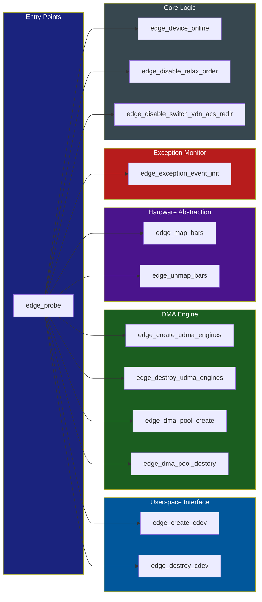

# Edge PCIe Core Module

The core module of the Edge PCIe driver, implementing PCIe endpoint device management, uDMA data transfers, MSI/MSI-X interrupt handling, character device interface, SMBus management, hardware exception monitoring, and boot-time DMA acceleration for Edge SoCs (x6000 series).

## Responsibilities

- **PCIe device initialization**: Probe, enable, BAR mapping, DMA mask configuration, AER error reporting
- **Interrupt management**: MSI-X (preferred), MSI (fallback), legacy INTx (last resort); notify IRQ channels for cross-chip communication
- **uDMA engine**: 4 DMA channels with descriptor ring; device-to-host (D2H), host-to-device (H2D), P2P inbound/outbound transfers
- **Character device interface**: Userspace access via `/dev/edge` with 20+ IOCTL commands for DMA, BAR R/W, boot, exception, bandwidth monitoring, LED control
- **MMIO access**: Direct BAR memory mapping via `mmap()` with write-combine caching
- **Notify IRQ**: 24 inter-chip notification channels per group, 2 groups (device-side, card-side), with shared memory ring buffer
- **Exception handling**: Hardware exception FIFO monitoring with severity levels (INFO/NOTICE/CRIT/EMERG)
- **SMBus management**: Inter-device SMBus arbitration, hotplug simulation, ARP table
- **Boot acceleration**: Pre-OS DMA to accelerate system startup (boot descriptor ring)
- **DMA pool**: Optional pre-allocated DMA buffer pool for low-latency transfers

## Key Interfaces

| Name | Kind | Description |
|------|------|-------------|
| `edge_probe()` | function | PCI probe: enable device, map BARs, create uDMA engines, create cdev, init exception/timer |
| `edge_remove()` | function | PCI remove: offline device, flush instances, tear down IRQs, release regions |
| `edge_enable_irq_vectors()` | function | Allocate MSI-X (preferred) or MSI vectors; fallback to legacy INTx |
| `edge_setup_irqs()` | function | Wire ISR handlers; configure MSI generator registers or DMA INT bridge |
| `edge_ioctl()` | function | 30+ IOCTL commands: DMA xfer, BAR R/W, boot R/W, exception wait, BW monitor, LED |
| `edge_mmap()` | function | Userspace BAR mmap with write-combine; handles BAR2/BAR4 for device/host memory |
| `edge_open()` / `edge_release()` | function | Character device open/close; lazy IRQ setup on first open |
| `edge_create_udma_engines()` | function | Initialize 4 uDMA engines with descriptor ring in BAR0 space |
| `edge_pcie_host_notify_irq_init/send/register()` | function | Inter-chip notification: init channel, send message, register notifier |
| `ioctl_do_udma_d2h_xfer()` / `ioctl_do_udma_h2d_xfer()` | function | DMA scatter-gather transfers between host and device |
| `edge_pci_tbl[]` | config | PCI device ID table: `0x17cd:0x0100` and `0x17cd:0x2000` |
| `dma_pool_enable` | config | Module param: enable DMA pool (default: disabled) |
| `EDGE_IRQ_MAX_NUM` | config | Maximum 49 interrupt vectors (MSI-X) |
| `EDGE_DMA_CH_NUM` | config | 4 DMA channels with linked-list descriptor ring |

## Dependencies

### Code Dependencies
- [[edge-pcie-driver]] — architecture overview of the Edge PCIe driver
- [[linux-pci-subsystem]] — Linux kernel PCI driver framework (probe/remove, pci_enable_device, pci_request_regions, pci_set_master)

### Hardware / Protocol Dependencies
- [[msi-msi-x]] — MSI/MSI-X interrupt mechanism: `pci_enable_msix_range()`, `pci_alloc_irq_vectors_affinity()`, MSI message address/data config
- [[pci-interrupt-mechanism]] — Legacy INTx fallback with `IRQF_SHARED` for exception events
- [[pci-express]] — PCIe transaction layer: Address Translation (AT) for inbound/outbound region remapping, BAR space management
- [[pci-bus]] — DMA operations: bus mastering, 64-bit DMA mask, scatter-gather list management
- [[pcie-ecam]] — PCIe Extended Configuration Access via `pci_read_config_dword` for MSI capability registers
- [[pci-virtualization]] — ACS redirection disable for P2P transfers; SR-IOV interrupt registers
- [[root-complex]] — PCIe Root Complex interaction: `pcie_bus_configure_settings`, platform device enumeration

## Data Flow

```
Userspace App
      │
      ▼
  /dev/edge (char device)
      │
      ├── ioctl(EDGE_IOCTL_UDMA_*_XFER) ──► uDMA Engine
      │                                       ├── D2H (device → host)
      │                                       ├── H2D (host → device)
      │                                       ├── P2P OB (outbound peer)
      │                                       └── P2P IB (inbound peer)
      │
      ├── ioctl(EDGE_IOCTL_READ/WRITE_BAR)  ──► BAR0..BAR5 (MMIO registers)
      │
      ├── mmap()                             ──► BAR2/BAR4 (device memory)
      │
      └── ioctl(EDGE_IOCTL_BOOT_*)          ──► Boot descriptor ring (pre-OS DMA)

Interrupt Flow (MSI-X preferred):
  Device Event
      │
      ▼
  PCIe MSI-X Message ──► CPU APIC
      │
      ▼
  edge_udma_isr() ──► schedule engine_service_work()
  edge_notify_irq_isr() ──► notify_irq notifier chain
  edge_pcie_exception_event_isr() ──► exception FIFO read → exception_work()

## Call Graph

### `edge_probe()` — PCI 设备初始化调用链

<!-- CODEGRAPH: edge_probe -->



### `edge_ioctl()` — IOCTL 分发

```mermaid
graph LR
    subgraph interface[Userspace Interface]
        ioctl_do_alloc_block_mem["ioctl_do_alloc_block_mem"]
        ioctl_do_boot_read["ioctl_do_boot_read"]
        ioctl_do_boot_read_pro["ioctl_do_boot_read_pro"]
        ioctl_do_boot_write["ioctl_do_boot_write"]
        ioctl_do_boot_write_pro["ioctl_do_boot_write_pro"]
        ioctl_do_bw_monitor_start["ioctl_do_bw_monitor_start"]
        ioctl_do_bw_monitor_stop["ioctl_do_bw_monitor_stop"]
        ioctl_do_copy_from_block_mem["ioctl_do_copy_from_block_mem"]
        ioctl_do_copy_to_block_mem["ioctl_do_copy_to_block_mem"]
        ioctl_do_free_block_mem["ioctl_do_free_block_mem"]
        ioctl_do_get_boot_state["ioctl_do_get_boot_state"]
        ioctl_do_get_card_type["ioctl_do_get_card_type"]
        ioctl_do_get_channel_status["ioctl_do_get_channel_status"]
        ioctl_do_get_ep_flags["ioctl_do_get_ep_flags"]
        ioctl_do_get_ext_init["ioctl_do_get_ext_init"]
        ioctl_do_get_instance_num["ioctl_do_get_instance_num"]
        ioctl_do_get_pcie_info["ioctl_do_get_pcie_info"]
        ioctl_do_inspur_topo["ioctl_do_inspur_topo"]
        ioctl_do_led["ioctl_do_led"]
        ioctl_do_link_info["ioctl_do_link_info"]
        ioctl_do_mmio_d2h_xfer["ioctl_do_mmio_d2h_xfer"]
        ioctl_do_mmio_h2d_xfer["ioctl_do_mmio_h2d_xfer"]
        ioctl_do_read_ext_addr["ioctl_do_read_ext_addr"]
        ioctl_do_set_device_id["ioctl_do_set_device_id"]
        ioctl_do_temperature["ioctl_do_temperature"]
        ioctl_do_write_ext_addr["ioctl_do_write_ext_addr"]
    end
    style interface fill:#01579b,color:#fff
    subgraph dma[DMA Engine]
        ioctl_do_boot_udma_h2d_xfer["ioctl_do_boot_udma_h2d_xfer"]
        ioctl_do_get_dma_pool_info["ioctl_do_get_dma_pool_info"]
        ioctl_do_udma_d2h_xfer["ioctl_do_udma_d2h_xfer"]
        ioctl_do_udma_h2d_xfer["ioctl_do_udma_h2d_xfer"]
        ioctl_do_udma_p2pib_xfer["ioctl_do_udma_p2pib_xfer"]
        ioctl_do_udma_p2pob_xfer["ioctl_do_udma_p2pob_xfer"]
    end
    style dma fill:#1b5e20,color:#fff
    subgraph hardware[Hardware Abstraction]
        ioctl_do_read_bar["ioctl_do_read_bar"]
        ioctl_do_write_bar["ioctl_do_write_bar"]
    end
    style hardware fill:#4a148c,color:#fff
    subgraph monitor[Exception Monitor]
        ioctl_do_config_exception["ioctl_do_config_exception"]
        ioctl_do_exception_owner["ioctl_do_exception_owner"]
        ioctl_do_wait_exception["ioctl_do_wait_exception"]
        ioctl_do_wait_exception_wakeup["ioctl_do_wait_exception_wakeup"]
    end
    style monitor fill:#b71c1c,color:#fff
    subgraph core[Core Logic]
        edge_ioctl["edge_ioctl"]
        edge_test_bit["edge_test_bit"]
    end
    style core fill:#37474f,color:#fff
    edge_ioctl["edge_ioctl"] --> edge_test_bit["edge_test_bit"]
    edge_ioctl["edge_ioctl"] --> ioctl_do_alloc_block_mem["ioctl_do_alloc_block_mem"]
    edge_ioctl["edge_ioctl"] --> ioctl_do_boot_read["ioctl_do_boot_read"]
    edge_ioctl["edge_ioctl"] --> ioctl_do_boot_read_pro["ioctl_do_boot_read_pro"]
    edge_ioctl["edge_ioctl"] --> ioctl_do_boot_udma_h2d_xfer["ioctl_do_boot_udma_h2d_xfer"]
    edge_ioctl["edge_ioctl"] --> ioctl_do_boot_write["ioctl_do_boot_write"]
    edge_ioctl["edge_ioctl"] --> ioctl_do_boot_write_pro["ioctl_do_boot_write_pro"]
    edge_ioctl["edge_ioctl"] --> ioctl_do_bw_monitor_start["ioctl_do_bw_monitor_start"]
    edge_ioctl["edge_ioctl"] --> ioctl_do_bw_monitor_stop["ioctl_do_bw_monitor_stop"]
    edge_ioctl["edge_ioctl"] --> ioctl_do_config_exception["ioctl_do_config_exception"]
    edge_ioctl["edge_ioctl"] --> ioctl_do_copy_from_block_mem["ioctl_do_copy_from_block_mem"]
    edge_ioctl["edge_ioctl"] --> ioctl_do_copy_to_block_mem["ioctl_do_copy_to_block_mem"]
    edge_ioctl["edge_ioctl"] --> ioctl_do_exception_owner["ioctl_do_exception_owner"]
    edge_ioctl["edge_ioctl"] --> ioctl_do_free_block_mem["ioctl_do_free_block_mem"]
    edge_ioctl["edge_ioctl"] --> ioctl_do_get_boot_state["ioctl_do_get_boot_state"]
    edge_ioctl["edge_ioctl"] --> ioctl_do_get_card_type["ioctl_do_get_card_type"]
    edge_ioctl["edge_ioctl"] --> ioctl_do_get_channel_status["ioctl_do_get_channel_status"]
    edge_ioctl["edge_ioctl"] --> ioctl_do_get_dma_pool_info["ioctl_do_get_dma_pool_info"]
    edge_ioctl["edge_ioctl"] --> ioctl_do_get_ep_flags["ioctl_do_get_ep_flags"]
    edge_ioctl["edge_ioctl"] --> ioctl_do_get_ext_init["ioctl_do_get_ext_init"]
    edge_ioctl["edge_ioctl"] --> ioctl_do_get_instance_num["ioctl_do_get_instance_num"]
    edge_ioctl["edge_ioctl"] --> ioctl_do_get_pcie_info["ioctl_do_get_pcie_info"]
    edge_ioctl["edge_ioctl"] --> ioctl_do_inspur_topo["ioctl_do_inspur_topo"]
    edge_ioctl["edge_ioctl"] --> ioctl_do_led["ioctl_do_led"]
    edge_ioctl["edge_ioctl"] --> ioctl_do_link_info["ioctl_do_link_info"]
    edge_ioctl["edge_ioctl"] --> ioctl_do_mmio_d2h_xfer["ioctl_do_mmio_d2h_xfer"]
    edge_ioctl["edge_ioctl"] --> ioctl_do_mmio_h2d_xfer["ioctl_do_mmio_h2d_xfer"]
    edge_ioctl["edge_ioctl"] --> ioctl_do_read_bar["ioctl_do_read_bar"]
    edge_ioctl["edge_ioctl"] --> ioctl_do_read_ext_addr["ioctl_do_read_ext_addr"]
    edge_ioctl["edge_ioctl"] --> ioctl_do_set_device_id["ioctl_do_set_device_id"]
    edge_ioctl["edge_ioctl"] --> ioctl_do_temperature["ioctl_do_temperature"]
    edge_ioctl["edge_ioctl"] --> ioctl_do_udma_d2h_xfer["ioctl_do_udma_d2h_xfer"]
    edge_ioctl["edge_ioctl"] --> ioctl_do_udma_h2d_xfer["ioctl_do_udma_h2d_xfer"]
    edge_ioctl["edge_ioctl"] --> ioctl_do_udma_p2pib_xfer["ioctl_do_udma_p2pib_xfer"]
    edge_ioctl["edge_ioctl"] --> ioctl_do_udma_p2pob_xfer["ioctl_do_udma_p2pob_xfer"]
    edge_ioctl["edge_ioctl"] --> ioctl_do_wait_exception["ioctl_do_wait_exception"]
    edge_ioctl["edge_ioctl"] --> ioctl_do_wait_exception_wakeup["ioctl_do_wait_exception_wakeup"]
    edge_ioctl["edge_ioctl"] --> ioctl_do_write_bar["ioctl_do_write_bar"]
    edge_ioctl["edge_ioctl"] --> ioctl_do_write_ext_addr["ioctl_do_write_ext_addr"]
```

<!-- CODEGRAPH: edge_ioctl -->



## Code References

- `edge.c:5826-5970` — `edge_probe()`: PCI device initialization
- `edge.c:5972-6050` — `edge_remove()`: PCI device teardown
- `edge.c:4999-5041` — `edge_enable_irq_vectors()`: MSI/MSI-X/INTx vector allocation
- `edge.c:4903-4950` — `edge_setup_irqs()`: ISR registration, MSI generator config
- `edge.c:5436-5470` — `edge_create_engine()`: uDMA engine with descriptor ring
- `edge.c:5172-5311` — `edge_ioctl()`: All IOCTL dispatch
- `edge.c:5313-5370` — `edge_mmap()`: BAR mmap with write-combine
- `edge.c:627-705` — `edge_pcie_host_notify_irq_init()`: Notify IRQ channel setup
- `edge.c:6349-6369` — Module init/exit, author/version/license
- `edge.h:457-510` — `struct edge_dev`: Main device structure
- `edge.h:349-364` — `struct udma_desc`: DMA descriptor format
- `edge.h:774-826` — All EDGE_IOCTL definitions


